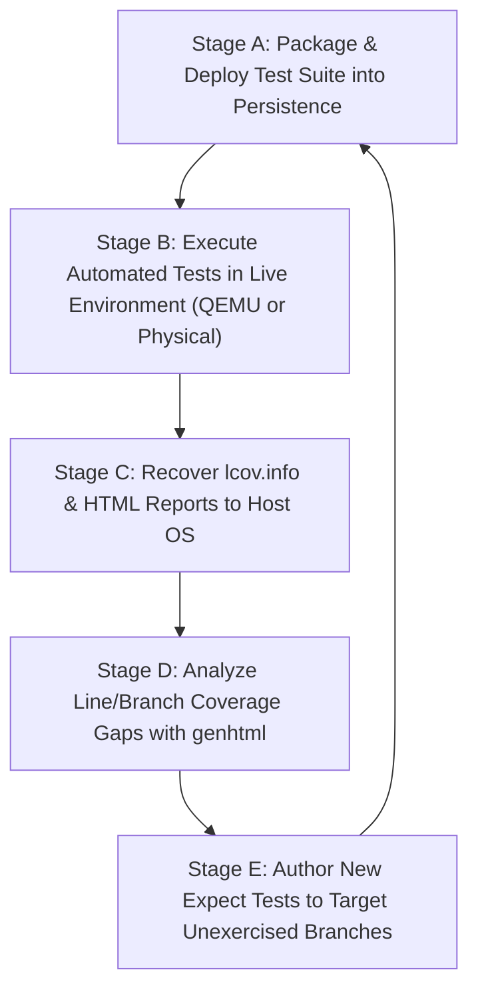

# Automated Test & Coverage Loop Architecture for Rescuezilla / Ventoy Tooling

**Author / Project Lead**: Alan P & Assistant  
**Date of Record**: September 6, 2026  
**Target Environment**: Live Persistence Overlay (`rescuezilla-persistence.dat`), QEMU Headless VM Test Harness (`run_test_vm.sh`), and Host Linux OS  
**Target Metric**: Line & Branch Coverage formatted for `lcov` (`lcov.info`) and HTML report visualization  

---

## 1. Executive Summary & Goals

### 1.1 Objective
Establish an automated, closed-loop CI/CD testing and coverage framework for all custom Rescuezilla Bash tooling:
* [`run_rescuezilla_backup_cli.sh`](file:///home/alan/ap-devices-and-pcs/devices/setup-usb-boot-keys/Ventoy/run_rescuezilla_backup_cli.sh)
* [`post-backup-wizard.sh`](file:///home/alan/ap-devices-and-pcs/devices/setup-usb-boot-keys/Ventoy/post-backup-wizard.sh)
* [`export_diagnostic_bundle.sh`](file:///home/alan/ap-devices-and-pcs/devices/setup-usb-boot-keys/Ventoy/export_diagnostic_bundle.sh)
* [`rescue_suite_launcher.sh`](file:///home/alan/ap-devices-and-pcs/devices/setup-usb-boot-keys/Ventoy/rescue_suite_launcher.sh)
* [`lib/lib_hardware_detect.sh`](file:///home/alan/ap-devices-and-pcs/devices/setup-usb-boot-keys/Ventoy/lib/lib_hardware_detect.sh)

### 1.2 Target 5-Stage Cycle


---

## 2. Technical Stack Selection & Justification

| Component | Selected Technology | Rationale & Alternatives Considered |
| :--- | :--- | :--- |
| **Instrumentation & Coverage Engine** | **`kcov` (v38+)** | Uses Linux `ptrace` directly against `/bin/bash`. Zero script modifications required. Produces native line coverage AND branch decision trees in standard `lcov.info` format. Far superior to manual `PS4` xtrace parsing. |
| **Interactive Prompt Automation** | **`expect` (Tcl) or Python `pexpect`** | Deterministically matches exact terminal output strings/prompts, tests input validation (empty enters, out-of-bounds numbers), simulates keystrokes, and aborts before destructive write phases. |
| **Execution Sandbox** | **QEMU Headless VM (`run_test_vm.sh`)** | Enables testing the entire persistence layer over SSH (`localhost:2222`) in under 45 seconds without rebooting the host machine. Safe CoW snapshot ensures zero physical flash wear. |
| **Physical Hardware Fallback** | **Bare-Metal Boot on /dev/sdb** | Tests can also run automatically upon physical boot on the HP EliteBook or ZBook, writing results directly to Partition 4 (NTFS). |
| **Report Generation & Analysis** | **`lcov` & `genhtml`** | Generates browsable, line-by-line, color-coded HTML reports highlighting green (hit), yellow (partial branch), and red (untested) lines. |

---

## 3. Detailed Phase-by-Phase Plan

### Phase 1: Test Suite Directory & Harness Structure
Establish a standardized `tests/` directory within the repository:
```text
Ventoy/
├── tests/
│   ├── harness/
│   │   ├── run_coverage_suite.sh     # Master runner that orchestrates kcov execution
│   │   └── mock_helpers.sh           # Mocking stubs for sshfs, mount, partclone, blkid
│   ├── cases/
│   │   ├── test_backup_cli_prompts.exp   # Tests prompt rejection, validation, DMI naming
│   │   ├── test_backup_cli_rescue.exp    # Tests Rescue Mode selection and flag passing
│   │   ├── test_post_backup_wizard.exp   # Tests bad sector detection regex & banner
│   │   ├── test_diagnostic_bundler.exp   # Tests Partition 4 dynamic mount & log harvesting
│   │   └── test_launcher_menu.exp        # Tests menu choices 1-10 in rescue_suite_launcher
│   └── fixtures/
│       ├── sample_partclone_bad_sectors.log  # Fixture for wizard bad sector triage
│       └── sample_clonezilla_success.log     # Fixture for clean backup testing
```

---

### Phase 2: Deployment into Persistence Container (Stage A)
Update [`Ventoy/deploy_four_tier_persistence.sh`](file:///home/alan/ap-devices-and-pcs/devices/setup-usb-boot-keys/Ventoy/deploy_four_tier_persistence.sh) to:
1. Copy `tests/` to `$TDIR/scripts/tests/`.
2. Ensure pre-compiled `kcov` and `expect` binaries (or cached `.deb` packages) are installed into `/usr/bin/` inside the persistence overlay container.
3. Expose a unified runner command `/usr/local/bin/run_tests`.

---

### Phase 3: Automated Test Execution & Instrumentation (Stage B)
1. **Master Test Script (`run_coverage_suite.sh`)**:
   ```bash
   #!/usr/bin/env bash
   COV_DIR="/tmp/coverage_out"
   mkdir -p "$COV_DIR"

   # Execute expect test scripts under kcov
   for test_case in /scripts/tests/cases/*.exp; do
       echo "[*] Running Test Case: $(basename "$test_case")..."
       kcov --include-path=/scripts --exclude-path=/scripts/tests "$COV_DIR" expect "$test_case"
   done

   # Consolidate lcov
   echo "[+] Cumulative Coverage Generated at: $COV_DIR"
   ```
2. **Deterministic Expect Assertions**:
   * Test rejection of empty Enter key in `prompt_choice()`.
   * Test rejection of non-numeric entries (e.g. `abc` or `99`).
   * Verify detected machine model (`HP-EliteBook-8470p` vs `HP-ZBook-15u-G5`).
   * Verify dynamic image name construction (`HP-EliteBook-8470p-sda1-sda2-...`).
   * Test pre-flight abort (`Start backup operation now? -> n`), ensuring safe execution with 0 bytes written to disk.

---

### Phase 4: Telemetry & Coverage Retrieval (Stage C)
1. **Host-Side Orchestration Script (`run_automated_coverage_loop.sh`)**:
   * Spins up QEMU headless VM using `run_test_vm.sh --boot 2 --display 2 --storage 1`.
   * Polls SSH on `localhost:2222` until the live environment is responsive (`ssh -p 2222 -o StrictHostKeyChecking=no ubuntu@localhost true`).
   * Dispatches `/scripts/tests/harness/run_coverage_suite.sh`.
   * Pulls the coverage output back to the host:
     ```bash
     scp -P 2222 -r ubuntu@localhost:/tmp/coverage_out ./Ventoy/coverage_results/
     ```
   * Gracefully shuts down the VM (`ssh -p 2222 ubuntu@localhost 'sudo poweroff'`).
2. **Physical Boot Retrieval**:
   * If run on real hardware, `run_coverage_suite.sh` copies `/tmp/coverage_out` directly to `/media/ubuntu/2C95D29B2DF0500E/coverage_results/`.

---

### Phase 5: Gap Analysis & Test Iteration (Stage D & E)
1. Generate browsable HTML report:
   ```bash
   genhtml ./Ventoy/coverage_results/kcov.info --output-directory ./Ventoy/coverage_results/html
   ```
2. **Branch Coverage Inspection**:
   * Check yellow lines in `lib_hardware_detect.sh` (e.g. NTFS vs FAT32 detection).
   * Check unreached `elif` branches in `post-backup-wizard.sh` (e.g. `RESCUE_SUCCESS` vs `SUCCESS_WITH_WARNINGS`).
3. Author targeted test cases to cover the missed branches, re-run the loop, and watch cumulative coverage reach >90%.

---

## 4. Verification & Safety Guarantees
* **Non-Destructive Storage**: All automated tests will terminate via explicit `n` responses at the pre-flight confirmation prompt.
* **Transient Overlays**: QEMU test runs use copy-on-write `qcow2` layers that evaporate upon VM termination, ensuring zero corruption risk to physical USB keys.
* **Strict "No PNGs" Policy**: Coverage reports will consist strictly of standard text-based `.info` files and HTML trees, adhering to version control policies.
