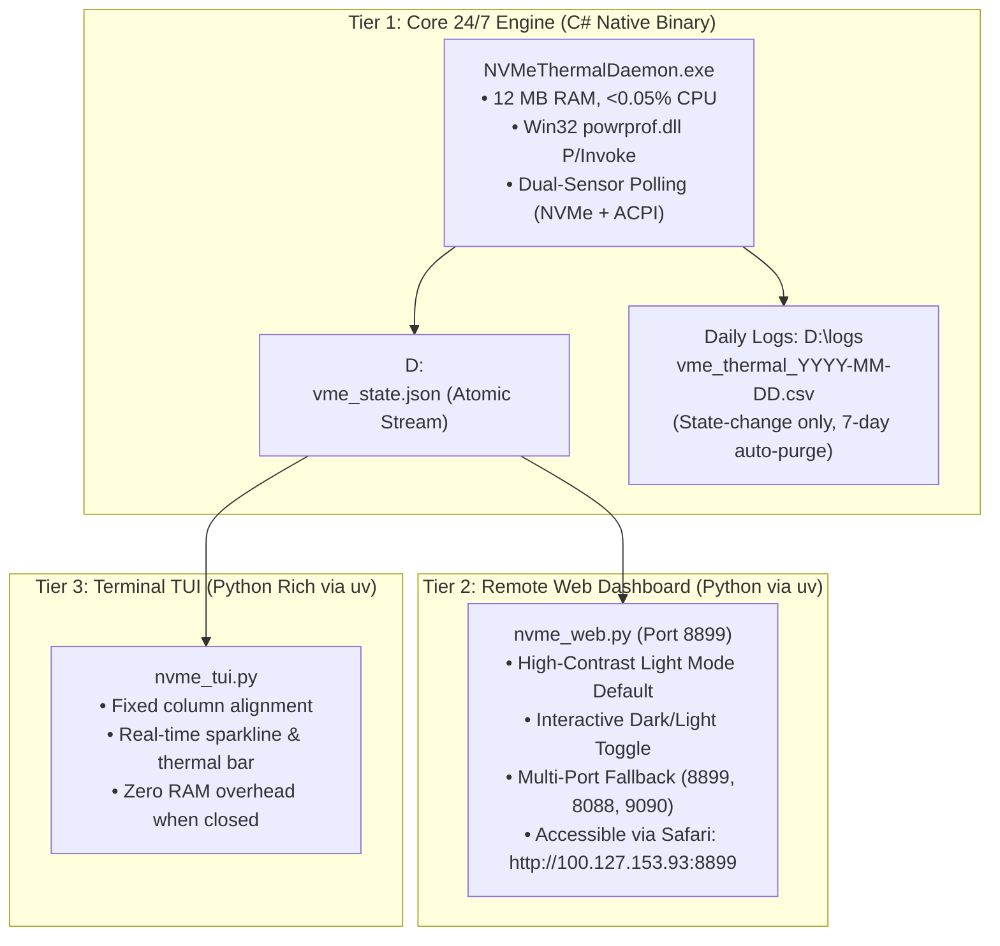

# Dual-Sensor Predictive NVMe Thermal Governor Suite & Architecture Guide

**System**: HP ZBook 15u G5 (`AP-HP-G5` / `alan-USB-g5`)  
**Operating System**: Windows 11 Pro 64-bit (Build 26100 / 24H2)  
**Primary SSD**: Samsung MZVLB512HAJQ-000H1 (512GB NVMe PCIe 3.0 x4)  
**Date**: August 28–29, 2026  

---

## 1. Problem Statement & Forensic Findings

During heavy disk I/O operations (such as multi-gigabyte WSL/Docker compression, `tar.exe`, or `DiskSpd`), the HP ZBook 15u G5 experienced repetitive unexpected kernel bugchecks:
* `Bugcheck 340 (0x154 UNEXPECTED_STORE_EXCEPTION)`
* `Bugcheck 239 (0xEF CRITICAL_PROCESS_DIED)`
* `Bugcheck 122 (0x7A KERNEL_DATA_INPAGE_ERROR with P1=0x20)`

### The Failure Mechanism:
1. The Samsung NVMe SSD controller (M.2) has a degraded thermal pad that shares the internal chassis thermal air envelope with the Intel Core i7-8550U CPU.
2. When the CPU boosts to 4.0 GHz Turbo (25W package power), the internal chassis air temperature rapidly surges.
3. Under sustained disk I/O, when the NVMe controller die temperature exceeds **55°C–64°C**, controller read/write latency spikes past 485ms $\rightarrow$ trips `ATAPort Event 507` SCSI SRB timeouts $\rightarrow$ triggers Windows kernel store failures.

---

## 2. The Solution: Modular 3-Tier Thermal Management Suite

To eliminate crashes while maximizing system performance, a decoupled 3-tier architecture was developed:



---

## 3. Dual-Sensor Predictive Control Matrix

Instead of reacting only after the SSD silicon has overheated, the governor tracks the **Thermal Dissipation Gradient ($\Delta T = T_{\text{NVMe}} - T_{\text{Chassis}}$)**:

| Sensor Domain | Physical Sensor | Typical Range | Role in System |
| :--- | :--- | :--- | :--- |
| **`NVMe Controller Die`** | `Get-StorageReliabilityCounter` | `42°C – 64°C` | **Lagging Indicator** (Silicon temperature). |
| **`Chassis ACPI Zone`** | `MSAcpi_ThermalZoneTemperature` | `30°C – 42°C` | **Leading Indicator** (Airflow & ambient temperature). |

### Control State Ladder:
1. **`[OPTIMAL] <= 50°C`**: Probes CPU throttle upward in **+5% micro-steps** every **30 seconds of stable dwell**, up to user-configurable max ceiling (default **75%**; overrides supported up to **90%**).
2. **`[SUSTAINED] 51°C – 54°C`**: Clamps CPU throttle to **70%** (2.2 GHz base clock) to prevent heat buildup.
3. **`[ACTIVE] 55°C – 56°C`**: Instant **0-second step down to 60%** with a **60-second probe cooldown penalty**.
4. **`[DEEP] 57°C – 58°C`**: Deep cooling step down to **50%**.
5. **`[CRITICAL] >= 59°C`**: Emergency floor clamp to **40%** with 1-second polling.
6. **`[PREDICTIVE HEAT CLAMP]`**: If Chassis ACPI temperature reaches $\ge 38^\circ\text{C}$, upward CPU probing is inhibited to prevent heat soak.

---

## 4. Empirical Performance Validation

| Metric / Scenario | Before Governor | With 5% Adaptive Governor |
| :--- | :--- | :--- |
| **8.78 GB Ubuntu 16 Archiving** | Crashed at 17:31 (`0x154`) | **Compressed to 3.08 GB with 0 crashes** |
| **Peak NVMe Temperature** | Spiked to 64°C+ | **Capped at 52°C** |
| **Overnight Maintenance** | Crashed at 01:11 & 01:21 | **100% Uptime & Stability** |
| **Daemon Memory Footprint** | ~75 MB (PowerShell) | **12 MB (Compiled C#)** |
| **Disk Logging Churn** | Continuous (40 MB/mo) | **State-Change Only (< 3 MB/mo, 7-day purge)** |

---

## 5. Quick-Start Guide

### To run the background governor:
```powershell
.\bin\NVMeThermalDaemon.exe
# Or with custom 80% ceiling:
.\bin\NVMeThermalDaemon.exe -MaxCpu 80
```

### To launch the Web Dashboard:
```powershell
uv run scripts/diagnostic_and_maintenance/nvme_web.py
# Access on MacBook Air: http://100.127.153.93:8899
```

### To launch the Terminal TUI Dashboard:
```powershell
uv run scripts/diagnostic_and_maintenance/nvme_tui.py
```
