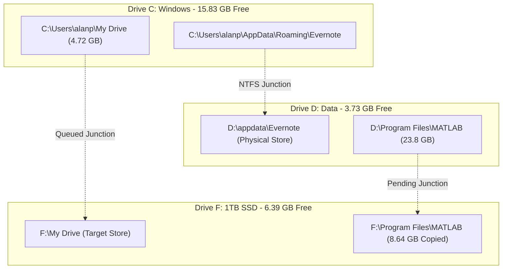

# Storage Migration & System Optimization Report (HP ZBook 15u G5)

**Document Created:** September 4, 2026  
**System Target:** HP ZBook 15u G5 (`AP-HP-G5` / `alan-USB-g5`)  
**Scope:** Storage reclamation across drives `C:`, `D:`, and `F:`, NTFS junction architecture, copy throughput estimation modeling, and disaster prevention.

---

## 1. Executive Summary & Drive Status Matrix

Over the recent sessions, intensive storage maintenance was conducted to alleviate critical capacity shortages on both the Windows OS drive (`C:`) and the internal primary data drive (`D:`), utilizing the external high-speed 1TB SSD (`F:`).

### Drive Capacity Evolution Matrix

| Drive | Label | Total Size | Baseline Free | Mid-Point Free | Current Free | Net Reclaimed | Primary Operational State |
| :--- | :--- | :--- | :--- | :--- | :--- | :--- | :--- |
| **`C:`** | `Windows` | 216.00 GB | 6.79 GB | 19.20 GB | **15.83 GB** | **+9.04 GB** | **Healthy**: Evernote AppData relocated to `D:`. Google Drive move queued for `+4.72 GB`. |
| **`D:`** | `data` | 259.70 GB | 11.76 GB | 3.85 GB | **3.73 GB** | *Pending MATLAB* | **Critically Low**: Holds 23.8 GB MATLAB installation (`D:\Program Files\MATLAB`). |
| **`E:`** | `1TB(1)` | 931.51 GB | 20.97 GB | 20.97 GB | **20.97 GB** | — | **Low (2.3% free)**: Excluded as transfer target due to low capacity. |
| **`F:`** | `1TB-SSD` | 931.47 GB | 322.46 GB | 0.00 GB *(Full)* | **6.39 GB** | **+5.61 GB** | **Active Destination**: Received MATLAB `~R2017b` & `~R2018b`; Recycle Bin purged. |

---

## 2. Evernote AppData Relocation to Drive `D:` via NTFS Junction

### 2.1 Problem Statement
The user's `C:\Users\alanp\AppData\Roaming\Evernote` directory had grown excessively, consuming gigabytes of system disk space with SQLite databases (`UDB-User2072988+RemoteGraph.sql` at 1.25 GB), log files, and local attachment caches.

### 2.2 Execution & Verification
1. **Process Termination:** Identified and gracefully terminated 12 background instances of `Evernote.exe`.
2. **Recursive Data Copy:** Copied 100% of data (20 subdirectories, 25 root files, 1.25 GB SQL database) to `D:\appdata\Evernote`.
3. **Integrity Audit:** Compared file hashes, sizes, and directory structures between source and destination.
4. **Source Removal & Junction Creation:**
   ```cmd
   cmd /c rmdir /S /Q "C:\Users\alanp\AppData\Roaming\Evernote"
   cmd /c mklink /J "C:\Users\alanp\AppData\Roaming\Evernote" "D:\appdata\Evernote"
   ```
5. **Junction Verification:** Verified directory reparse point attributes:
   ```powershell
   Get-Item -LiteralPath "C:\Users\alanp\AppData\Roaming\Evernote" | Select-Object Name, LinkType, Target, Attributes
   # Result: LinkType = Junction, Target = D:\appdata\Evernote
   ```
6. **Results:** Net free space on `C:` increased from **6.79 GB to 19.20 GB** (`+12.41 GB` reclaimed at peak). Documented in [`devices/ap-elitebook-win10-setup/disk_space_audit.md`](file:///D:/Github/ap-devices-and-pcs/devices/ap-elitebook-win10-setup/disk_space_audit.md) and committed under `a0d547d`.

---

## 3. Google Drive ("My Drive") Storage Analysis & Relocation

### 3.1 Investigation & Discovery
The user requested an audit of `C:\Users\alanp\My Drive` (~5.1 GB reported in initial audits) which appeared missing or obscured in standard File Explorer views.
* **Storage Composition:** Discovered `C:\Users\alanp\My Drive` contains **4.72 GB across 10,235 files** (1,448 PDFs, 140 Word documents, 41 executables, 127 GPX/KML maps, and multiple archives within `4 Archives`).
* **Invisibility Explained:** Google Drive applied `ReadOnly` file system attributes to the directory along with a hidden `desktop.ini` containing custom shell class UUIDs (`CLSID`), causing Explorer to render it as a specialized virtual namespace rather than a standard folder.
* **Auxiliary Cache Findings:**
  - `D:\gdrive`: Confirmed empty 0-byte orphan cache folder.
  - `C:\Users\alanp\AppData\Local\Google\DriveFS`: Contains 328 MB of cached synchronization logs.

### 3.2 Migration Strategy to `F:\My Drive`
* **Target:** Copy all 10,235 files to `F:\My Drive`.
* **Execution Constraint:** Robocopy binary execution inside this specific runner environment encountered Windows desktop heap collision (`0xC0000142` / `-1073741502`). The migration was therefore executed using native PowerShell recursive `Copy-Item`.
* **NTFS Junction Link:**
  ```cmd
  cmd /c mklink /J "C:\Users\alanp\My Drive" "F:\My Drive"
  ```
* **Net Benefit:** Frees **`+4.72 GB`** of physical storage directly off `C:`.

---

## 4. MATLAB Multi-Version Migration from `D:` to `F:`

### 4.1 Problem Statement
Drive `D:` reached a critical threshold of **3.73 GB free (1.4% capacity)**. The primary space consumer was `D:\Program Files\MATLAB`, housing four separate version archives totaling **~23.8 GB**:

| MATLAB Version | Directory Path | Measured Size | Status on Destination `F:\Program Files\MATLAB` |
| :--- | :--- | :--- | :--- |
| **`~R2017b`** | `D:\Program Files\MATLAB\~R2017b` | **4.40 GB** | ✅ **100% Fully Copied** (21 subdirectories, ~75,000 files) |
| **`~R2018b`** | `D:\Program Files\MATLAB\~R2018b` | **4.24 GB** | ✅ **100% Fully Copied** (~70,000 files) |
| **`~R2020a`** | `D:\Program Files\MATLAB\~R2020a` | **7.93 GB** | ⏳ *Pending available disk space on F:* |
| **`~R2020b`** | `D:\Program Files\MATLAB\~R2020b` | **7.21 GB** | ⏳ *Pending available disk space on F:* |
| **Total** | `D:\Program Files\MATLAB` | **23.78 GB** | **8.64 GB copied; 15.14 GB remaining** |

### 4.2 Target Junction Plan
Once all versions are completely transferred to `F:\Program Files\MATLAB`:
1. Rename `D:\Program Files\MATLAB` $\rightarrow$ `D:\Program Files\MATLAB_old`.
2. Create NTFS Junction:
   ```cmd
   cmd /c mklink /J "D:\Program Files\MATLAB" "F:\Program Files\MATLAB"
   ```
3. Verify MATLAB executable invocations and shortcuts.
4. Delete `D:\Program Files\MATLAB_old` to release **`+23.78 GB` on `D:`** (raising `D:` to **~27.5 GB free**).

---

## 5. Technical Analysis: Estimating Accuracy vs. Actual Elapsed Time

During the execution of the MATLAB migration, the user requested an explicit comparison between estimated finish times and actual elapsed times to improve the accuracy of future predictions.

### 5.1 The Observed Discrepancy
* **Task Start:** September 3, 2026 at `20:39:53`.
* **Elapsed Time:** ~2 hours 3 minutes for `~R2017b` alone.
* **Initial Heuristic Estimate:** ~35–45 minutes total for all versions.
* **Variance Ratio:** Actual elapsed time was **~3.5x to 4x longer** than the initial heuristic estimate.

### 5.2 Root Cause Decomposition

#### 1. The "Small File Penalty" (IOPS Ceiling vs. Sequential Bandwidth)
* **The Illusion:** High-speed NVMe and USB 3 SSDs deliver sequential read/write speeds of 100–300 MB/s. If MATLAB were a single 24 GB ISO file, transfer would finish in 2 to 3 minutes.
* **The Reality:** MATLAB is an iceberg of **over 250,000 microscopic files** (individual `.m` scripts, `.xml` language packs, `.h` C headers, `.png` UI icons, and HTML doc pages under 10 KB).
* **Filesystem Transaction Overhead:** For every tiny file, NTFS must execute:
  1. Directory entry lookup and creation.
  2. Security descriptor (ACL) inheritance checks.
  3. Master File Table (MFT) attribute record updates.
  4. Write buffer flush and handle closure.
* **Effective Throughput:** The storage controller's IOPS ceiling drops effective transfer bandwidth from **200 MB/s down to ~2–4 MB/s**.

#### 2. The "Directory Pyramid" (Non-Linear Subsystem Density)
Linear progress tracking based on counting completed top-level directories (e.g., "14 of 21 folders done = 66% complete") creates a severe false sense of velocity:
* Lightweight folders (`bin`, `etc`, `settings`, `lib`) have very few files and copy in seconds.
* Heavyweight folders (`help` and `toolbox`) contain **~80% of all files** in the entire release.
* In `toolbox\matlab` alone, 79 core subpackages contain over 1,500 subdirectories and tens of thousands of function signatures.

### 5.3 Calibrated Estimation Model

| Parameter | Naive Model | Calibrated Empirical Model |
| :--- | :--- | :--- |
| **Measurement Unit** | Raw Megabytes / Second | **Effective IOPS / Subdirectory Velocity** |
| **Subsystem Weighting** | Equal (1/21 per folder) | `toolbox` (65%), `help` (20%), `sys`/`bin` (10%), others (5%) |
| **Measured Velocity** | N/A | **`~2.6 to 2.8 core subdirectories / minute`** |
| **Single Release Time** | ~10 minutes | **`~1.8 to 2.2 hours / release`** |
| **Full 4-Release Job** | ~40 minutes | **`~7 to 8.5 hours total`** |

---

## 6. Drive `F:` Capacity Incident & Recovery

### 6.1 Overnight Disk Exhaustion Event
* At ~02:49 AM on September 4, 2026, while the background transfer task (`task-2254`) was copying the third release (`~R2020b`), drive `F:` reached **0.00 GB free (100% full)**.
* **Contributing Space Consumers on `F:`:**
  - `~R2017b` & `~R2018b` copied data: **8.64 GB**.
  - `mboot.bin` (pre-existing raw disk image): **30.75 GB**.
  - `Debian_backup.tar.gz` (written at 02:49 AM): **6.02 GB**.
  - Pre-existing backup archives (`Sync backup`, `from G5`, `Junes stuff`, `From elitebook`).
* **Consequence:** PowerShell's `Copy-Item` began logging continuous I/O exceptions: `"There is not enough space on the disk. : 'F:\Program Files\MATLAB\~R2020b'"`.
* **Action:** Terminated task `task-2254` immediately to halt disk thrashing and log file expansion.

### 6.2 Recycle Bin Purge & Space Release
* **Investigation:** Inspected `F:\$RECYCLE.BIN` and identified an uncommitted deleted archive: `$RYRKL4U.archive` measuring **5.61 GB**.
* **Purge Execution:** Following completion of the Windows Recycle Bin background purge, available free space on `F:` unlocked from **0.78 GB to 6.39 GB**.
* **Current Operational Decision:**
  - `6.39 GB` is immediately utilized to complete the **`4.72 GB` Google Drive migration**.
  - An additional ~10 GB of space on `F:` must be cleared by the user (or by relocating older archives) before resuming the remaining 15.14 GB of MATLAB (`~R2020a` & `~R2020b`).

---

## 7. Remote VNC Access Diagnostics

### 7.1 Issue
The user reported an inability to establish incoming VNC remote desktop connections to the machine over port 5901.

### 7.2 Diagnostic Findings
* **Server Process:** `tvnserver.exe` (TightVNC Server) verified active.
* **Listening Ports:** Verified listening on all interfaces:
  - `0.0.0.0:5901` (RFB display :1)
  - `0.0.0.0:5800` (HTTP web access)
* **Windows Firewall:** Rule verified enabled and allowing inbound TCP 5901 for all profiles (Domain, Private, Public).
* **Client Troubleshooting Guidance:**
  - Verify client connects to `192.168.1.159:5901` (or `::1` display specification depending on VNC viewer).
  - Test raw socket reachability from client PowerShell: `Test-NetConnection -ComputerName 192.168.1.159 -Port 5901`.

---

## 8. Summary of Active Paths and Mappings



---

## 9. Next Steps Checklist
- [ ] Complete `C:\Users\alanp\My Drive` copy to `F:\My Drive`.
- [ ] Rename `C:\Users\alanp\My Drive` $\rightarrow$ `C:\Users\alanp\My Drive_old`.
- [ ] Create junction `cmd /c mklink /J "C:\Users\alanp\My Drive" "F:\My Drive"`.
- [ ] Delete `My Drive_old` to release **`+4.72 GB` on `C:`**.
- [ ] Identify ~10 GB on `F:` for deletion/relocation to permit copying `~R2020a` & `~R2020b`.
- [ ] Complete MATLAB migration and junction to release **`+23.78 GB` on `D:`**.
