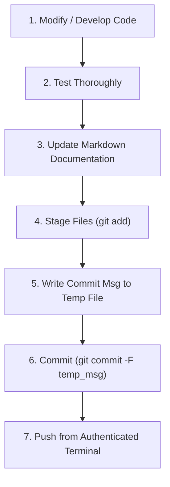

# MSYS2 Git Development & Synchronization Workflow

This document outlines the standard operating procedure (SOP) for making changes, updating documentation, testing, committing, and pushing Git repositories in MSYS2 on Windows.

---

## 1. Directory & Environment Context

* **MSYS2 Root Path:** `D:\msys64`
* **Home Directory (POSIX):** `/home/alanp/`
* **Home Directory (Windows Path):** `D:\msys64\home\alanp\`
* **Target Repositories:**
  - `run_mosh`: `/home/alanp/run_mosh` $\rightarrow$ `D:\msys64\home\alanp\run_mosh`
  - `ap-devices-and-pcs`: `D:\Github\ap-devices-and-pcs`

---

## 2. Standard Development Workflow (Step-by-Step)



---

### Step 1: Making Code or Script Changes
Make all necessary modifications to your scripts (e.g. `run_mosh.sh`, `tmux-menu.sh`).
* **Rule:** Always explain what changes are proposed and why before executing them.

---

### Step 2: Test Thoroughly
Before staging or committing, execute the script or run automated tests:
```bash
# In MSYS2 Bash:
cd /home/alanp/run_mosh
chmod +x tmux-menu.sh run_mosh.sh
./tmux-menu.sh
```

---

### Step 3: Update Documentation First
* **Rule:** Documentation markdown files (`README.md`, `CHANGELOG.md`, `SPEC.md`) must be kept up to date **before** creating git commits.
* Document any new scripts, modified command arguments, or configuration options.

---

### Step 4: Check Status & Stage Files
Verify which files have changed:
```bash
git status
```
Stage the specific modified code and documentation files:
```bash
git add README.md tmux-menu.sh run_mosh.sh
```

---

### Step 5: Commit Using a Temporary Message File
* **Rule:** When committing to Git, write the commit message into a temporary file and pass `-F <file_path>` to `git commit`.

#### In MSYS2 Bash:
```bash
# 1. Create a temporary message file
cat << 'EOF' > /tmp/commit_msg.txt
feat: add interactive tmux session manager and update documentation

- Add tmux-menu.sh script providing interactive listing, attachment, and creation of tmux sessions.
- Update README.md with usage instructions and feature documentation for tmux-menu.sh.
EOF

# 2. Commit using -F
git commit -F /tmp/commit_msg.txt

# 3. Remove the temporary file
rm -f /tmp/commit_msg.txt
```

#### In PowerShell (pwsh):
```powershell
$tempFile = "$env:TEMP\git_commit_msg.txt"
@"
feat: add interactive tmux session manager and update documentation

- Add tmux-menu.sh script providing interactive listing, attachment, and creation of tmux sessions.
- Update README.md with usage instructions and feature documentation for tmux-menu.sh.
"@ | Set-Content -Path $tempFile -Encoding utf8

git commit -F $tempFile
Remove-Item -Path $tempFile -Force
```

---

### Step 6: Pushing to Remote Repositories (Authentication)

#### Why HTTPS Repositories Require Interactive Pushes:
When repositories use HTTPS URLs (`https://github.com/alan-prudom/run_mosh.git`), GitHub requires user authentication (Personal Access Token or Web Credential). In non-interactive background agent shells, `git push` will wait for a username/password prompt.

#### To Push from Your Logged-In MSYS2 Terminal:
Open your MSYS2 terminal and run:
```bash
cd /home/alanp/run_mosh
git push origin main
```
Enter your GitHub username and Personal Access Token (PAT) when prompted.

#### (Optional) Configuring Credential Caching in MSYS2:
To avoid entering credentials on every push in MSYS2, enable Git credential caching:
```bash
# Cache credentials in memory for 8 hours (28800 seconds)
git config --global credential.helper 'cache --timeout=28800'
```
*(Or use `git config --global credential.helper store` to store encrypted tokens in your user profile)*.

---

## 3. Quick Reference Command Summary

| Action | MSYS2 Command | Notes |
| :--- | :--- | :--- |
| **Check Branch & Status** | `git status` | Verifies clean vs modified files |
| **View Recent Commits** | `git log -n 5 --oneline` | Lists commit history |
| **Stage Files** | `git add <files>` | Stages code + docs |
| **Commit (Temp File)** | `git commit -F /tmp/msg.txt` | Standard project rule |
| **Push to GitHub** | `git push origin main` | Run in interactive MSYS2 terminal |
| **Pull Upstream Updates** | `git pull origin main` | Fetches and merges remote changes |
