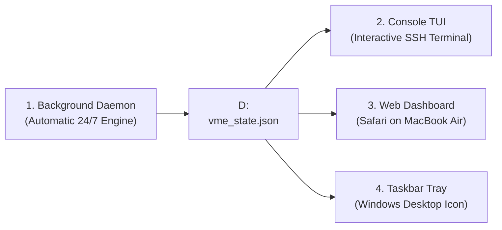

# Dual-Sensor NVMe Thermal Governor: Quick Start Guide

**Target System**: HP ZBook 15u G5 (`AP-HP-G5` / `alan-USB-g5`)  
**OS**: Windows 11 Pro 64-bit (Build 26100 / 24H2)  
**Primary SSD**: Samsung MZVLB512HAJQ-000H1 (512GB NVMe PCIe 3.0 x4)  
**Repository Path**: `D:\Github\ap-devices-and-pcs\devices\setup-usb-boot-keys`  

---

## 1. Quick Reference: The 4 Interfaces



| Interface | Best Used For | How to Launch / Access |
| :--- | :--- | :--- |
| **1. Background Daemon** | **24/7 Unattended Protection** | **Auto-Starts at Boot** (`NVMeThermalGovernor` Task). |
| **2. Interactive TUI** | **Remote SSH Monitoring** | `uv run scripts/diagnostic_and_maintenance/nvme_tui.py` |
| **3. Web Dashboard** | **MacBook Air Browser** | Open [`http://100.127.153.93:8899`](http://100.127.153.93:8899) in Safari. |
| **4. Taskbar Tray Icon** | **Windows Desktop** | **Auto-Starts at Login** (Shows green temperature number next to clock). |

---

## 2. Interface 1: Interactive Terminal TUI Dashboard

The Terminal TUI provides an ASCII/Unicode dashboard optimized for high-contrast light mode over SSH.

### How to Run:
In your **macOS SSH terminal** (or Windows PowerShell):

```powershell
uv run D:\Github\ap-devices-and-pcs\devices\setup-usb-boot-keys\scripts\diagnostic_and_maintenance\nvme_tui.py
```

### What You See on Screen:
* **NVMe Controller Die Gauge**: Live temperature (e.g. `44°C` in dark green) with safety threshold bar ($\le 50^\circ\text{C}$ safe floor, $55^\circ\text{C}$ active throttle).
* **Chassis ACPI Airflow Gauge**: Ambient motherboard temperature (e.g. `30°C`).
* **Thermal Gradient ($\Delta T$)**: Real-time dissipation efficiency ($\Delta T = T_{\text{NVMe}} - T_{\text{Chassis}}$).
* **CPU Power Throttle Limit**: Real-time CPU power index (e.g. `70%` / `75%`).
* **Interactive Controls**:
  * Press **`7`**: Instantly request **70% CPU Limit** (conservative cooling).
  * Press **`8`**: Instantly request **80% CPU Limit** (higher performance).
  * Press **`Ctrl + C`**: Exit TUI cleanly (the background daemon continues running).

---

## 3. Interface 2: Remote Web Dashboard (MacBook Air / Safari)

The Web Dashboard delivers a graphical interface directly in your browser without requiring VNC.

### How to Access:
* **On your MacBook Air**: Open [`http://100.127.153.93:8899`](http://100.127.153.93:8899) in Safari.
* **On Local Windows**: Open [`http://localhost:8899`](http://localhost:8899) in any browser.

### Key Features:
* **High-Contrast Light Mode Default**: Crisp white/slate cards with dark typography.
* **Theme Toggle Switch**: Click **"Dark Mode / Light Mode"** in the top right to switch styles instantly.
* **Auto-Refreshing Gauges**: Updates live every 1.5 seconds via `/api/state`.

---

## 4. Interface 3: Windows Desktop System Tray App

Runs silently in your graphical user session to give you immediate taskbar feedback.

### Key Features:
* **Dynamic Temperature Number**: The 16x16 icon dynamically paints the live temperature number (`43`) in bold white against a color-coded background (Green $\le 50^\circ\text{C}$, Orange $51-54^\circ\text{C}$, Red $\ge 57^\circ\text{C}$).
* **Hover Tooltip**: Displays full status (`NVMe: 43°C | Chassis: 30°C | CPU: 75% | State: OPTIMAL`).
* **Right-Click Menu**:
  * Select **"Set Max CPU Ceiling"** $\rightarrow$ choose **70%, 75%, 80%, 85%, or 90%**.
  * Click **"Open Web Dashboard"** $\rightarrow$ launches local browser.

---

## 5. Interface 4: Core Background Governor Daemon

The core governor runs 24/7/365 as a native C# binary in Windows Session 0.

### Key Metrics & Files:
* **Binary Location**: `D:\Github\ap-devices-and-pcs\devices\setup-usb-boot-keys\bin\NVMeThermalDaemon.exe`
* **RAM / CPU Footprint**: **~12–19 MB RAM, <0.05% CPU**.
* **Atomic State Snapshot**: `D:\nvme_state.json` (polled every 1–4 seconds).
* **State-Change Daily CSV Logs**: `D:\logs\nvme_thermal_YYYY-MM-DD.csv` (auto-purges logs $>7$ days old).

### To Manually Inspect State via Shell:
```powershell
Get-Content D:\nvme_state.json
```

---

## 6. Service Management Commands (Administrator)

If you ever need to register, inspect, or restart services:

```powershell
# Re-register auto-start tasks:
pwsh D:\Github\ap-devices-and-pcs\devices\setup-usb-boot-keys\scripts\diagnostic_and_maintenance\register_thermal_service.ps1

# Check Scheduled Task status:
Get-ScheduledTask NVMeThermalGovernor

# Restart TightVNC service (if desktop ever needs re-hooking):
Restart-Service tvnserver
```

---

## 7. Bidirectional UEFI One-Time Boot Commands

To switch between Windows 11 and USB Linux programmatically without pressing BIOS keys:

### A. Boot from Windows 11 $\rightarrow$ USB Linux:
In Windows **Administrator PowerShell**:
```powershell
pwsh D:\Github\ap-devices-and-pcs\devices\setup-usb-boot-keys\scripts\diagnostic_and_maintenance\boot_to_linux.ps1
```
* Queries `bcdedit /enum firmware`, programs `{fwbootmgr} bootsequence` to the target USB Linux EFI entry, and reboots directly into Linux.
* Or select **`[M]`** to enter the Windows Advanced Startup / UEFI Device Selection menu (`shutdown /r /o`).

### B. Boot from Linux $\rightarrow$ Windows 11:
In **Linux Bash** (on USB key):
```bash
sudo ./scripts/diagnostic_and_maintenance/boot_to_windows.sh
```
* Uses `efibootmgr --bootnext` to dynamically set the next boot target to `Windows Boot Manager` and restarts back into Windows 11.

---

## 8. Parallel Dual-SSH & Mosh Access (Port 22 vs. Port 2222)

The system runs two distinct OpenSSH servers in parallel:

| Connection Type | Port & Protocol | Target Environment | Key Benefit |
| :--- | :--- | :--- | :--- |
| **Native Windows OpenSSH** | **Port 22 (TCP)** | Windows PowerShell / CMD | Full Win32 administration, WMI, and services. |
| **MSYS2 OpenSSH + Mosh** | **Port 2222 (TCP) + UDP 60000-61000** | MSYS2 POSIX Bash | **Sleep-proof, roamable, zero-lag typing** across Wi-Fi drops. |

### To Connect from MacBook Air:
* **Native PowerShell (Port 22)**: `ssh alanp@100.127.153.93`
* **MSYS2 Bash (Port 2222)**: `ssh -p 2222 alanp@100.127.153.93`
* **Mosh Session (Roamable)**: `mosh --ssh="ssh -p 2222" alanp@100.127.153.93`

### To Verify Dual-SSH & Mosh Status on Windows:
```powershell
pwsh D:\Github\ap-devices-and-pcs\devices\setup-usb-boot-keys\scripts\diagnostic_and_maintenance\verify_msys2_sshd_and_mosh.ps1
```

---

## 9. HP ZBook 15u G5 Disaster Recovery & WSL Documentation

Comprehensive recovery reports and storage audits for the HP ZBook 15u G5 are maintained in the [`docs/G5/`](G5/README.md) directory:

* **[docs/G5/DETAILED_RECOVERY_REPORT.md](G5/DETAILED_RECOVERY_REPORT.md)** — Statement-by-statement report on recovering deleted WSL `ext4.vhdx` from a remote Clonezilla backup image over NAS (`192.168.1.34` on `/media/alan/home40`) using zero-disk-space sparse NBD architecture.
* **[docs/G5/UBUNTU_RECOVERY_COMPLETE.md](G5/UBUNTU_RECOVERY_COMPLETE.md)** — Completion audit for WSL 2 Ubuntu restoration, VHDX header verification, filesystem checks, and relocation to `D:\WSL-distros\Ubuntu-24.04`.
* **[docs/G5/REBOOT_STATE_CHECKPOINT.md](G5/REBOOT_STATE_CHECKPOINT.md)** — System pre-reboot checkpoint documenting WSL distributions, PC disk space metrics, and remote Linux NAS cleanup.
* **[docs/G5/disk_space_audit.md](G5/disk_space_audit.md)** — Storage breakdown and disk space audit for the HP ZBook 15u G5.


