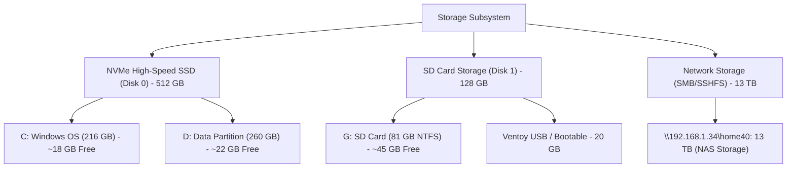

# Hardware Specification & Technical Inventory

**Host Environment**: `alan-USB-g5`  
**Date of Audit**: July 30, 2026  
**System Classification**: Mobile Workstation

---

## 1. System & Chassis Overview

| Property | Value / Specification |
| :--- | :--- |
| **Manufacturer** | HP (Hewlett-Packard) |
| **Product Model** | HP ZBook 15u G5 |
| **Form Factor** | Mobile Workstation Laptop |
| **System Architecture** | x86_64 (64-bit) |
| **BIOS / Firmware Version** | Q78 Ver. 01.31.00 |
| **Operating System** | Ubuntu 22.04.5 LTS (Jammy Jellyfish) |

---

## 2. Processor (CPU) Specifications

```
  +-------------------------------------------------------------+
  |              Intel(R) Core(TM) i7-8550U CPU                 |
  |   4 Physical Cores | 8 Logical Threads | 8 MB L3 Cache      |
  |        1.80 GHz Base Clock -> 4.00 GHz Turbo Boost          |
  +-------------------------------------------------------------+
```

| Parameter | Detailed Specification |
| :--- | :--- |
| **CPU Model** | Intel(R) Core(TM) i7-8550U CPU @ 1.80GHz |
| **Microarchitecture** | Kaby Lake R (8th Generation Core i7) |
| **Physical Cores** | 4 Cores |
| **Logical Processors (Threads)** | 8 Threads (Hyper-Threading enabled) |
| **Base Clock Speed** | 1.80 GHz |
| **Max Turbo Frequency** | 4.00 GHz |
| **L3 Cache Size** | 8192 KB (8 MB) |
| **CPU Stepping / Microcode** | Stepping 10, Microcode `0xf6` |
| **Instruction Set & Features** | AVX2, SSE4.1/4.2, AES-NI, VT-x (VMX), BMI1/BMI2, FMA3, Turbo Boost, SpeedStep |
| **Security Mitigation Flags** | PTI, IBRS, IBPB, STIBP, SSBD (Meltdown & Spectre mitigations active) |

---

## 3. System Memory (RAM)

| Parameter | Capacity / Status |
| :--- | :--- |
| **Total Physical RAM** | **16 GB** DDR4 (15.85 GB usable) |
| **Virtual Memory (Pagefile)** | System Managed (`AutomaticManagedPagefile = True`) on `C:\` |
| **Peak Commit Limit** | ~32 GB dynamic pool |

---

## 4. Storage Subsystem & Drive Inventory



### Partition & Volume Status (August 28, 2026)

| Volume / Drive | Type / Bus | File System | Size | Used | Free | Status | Purpose |
| :--- | :--- | :--- | :--- | :--- | :--- | :--- | :--- |
| **`C:`** | NVMe (Disk 0, Part 3) | NTFS | 216.0 GB | 198 GB | **~18 GB** | Healthy | Windows 11 OS, Pagefile, VSS (10GB max) |
| **`D:`** | NVMe (Disk 0, Part 4) | NTFS | 259.7 GB | 237 GB | **~22 GB** | Healthy | Data, Git repos, `.vscode`, Docker AppData, Sync |
| **`G:`** | USB/SD (Disk 1, Part 1) | NTFS | 81.0 GB | 36 GB | **~45 GB** | Healthy | Secondary Storage, `My Drive` (Google Drive cache) |
| **Ventoy** | USB Flash (`E:`) | exFAT | 19.0 GB | 18 GB | 1.3 GB | Operational | Multi-boot ISO utility drive |
| **`home40`** | Remote SMB/SSHFS | exFAT/ext4 | 13 TB | 11 TB | 2.2 TB | Healthy | Network backup storage (`192.168.1.34`) |

---

## 5. NVMe SSD Detailed Health & SMART Telemetry (August 28, 2026)

| Parameter | Value / Metric | Status / Assessment |
| :--- | :--- | :--- |
| **Device Model** | **SAMSUNG MZVLB512HAJQ-000H1** | High-performance PCIe Gen3 x4 NVMe |
| **Capacity** | 512,110,190,592 Bytes (512 GB) | GPT Partitioned |
| **Serial Number** | `S3WTNX0M381174` | Unique Hardware ID |
| **Firmware Version** | `EXA73H1Q` | Current Samsung OEM Firmware |
| **Physical Sector Size** | 4096 Bytes (4K Native) | Aligned |
| **Logical Sector Size** | 512 Bytes (512e Emulation) | Standard |
| **Bus / Slot Location** | PCI Slot 8 : Bus 60 : Device 0 : Function 0 | Direct CPU PCIe Lane |
| **NAND Wear Counter** | **`0`** | **EXCELLENT** — 0% wear, NAND cells in prime health |
| **Uncorrected Read Errors** | **`0`** | **EXCELLENT** — Zero bad blocks or bad sectors |
| **Current Temperature (Idle)** | **56°C** | Elevated for idle state |
| **Maximum Recorded Temp** | **81°C** | 🔴 **CRITICAL** — Hits Samsung thermal throttle point |
| **Maximum Read Latency** | **485 ms** | 🔴 **HIGH** — Spikes during 81°C thermal throttling |
| **Maximum Write Latency** | **82 ms** | Normal under load |

### Thermal Remediation Requirement:
- The Samsung NVMe thermal interface pad under the M.2 slot requires replacement (1mm high-conductivity pad).
- Operating temperatures above 70°C activate firmware thermal throttling, creating ~485ms read latency spikes.

---

## 6. Network Hardware & Controllers

| Interface Name | Controller Type | Hardware / Protocol Details | Status / IP Address |
| :--- | :--- | :--- | :--- |
| **`Ethernet` (`enp0s31f6`)** | Physical Gigabit | Intel I219-LM PCI-E Gigabit Ethernet | **UP** (`192.168.1.159/24`) |
| **`Wi-Fi` (`wlp2s0`)** | Wireless AC | Intel Dual Band Wireless-AC 8265 | Operational |
| **`tailscale0`** | Virtual VPN | Tailscale WireGuard Mesh VPN | **UP** (`100.127.153.93`) |
| **OpenSSH Daemon** | Remote Service | Windows OpenSSH Server (`sshd`) | **Running** (Port 22, Auto) |

---

## 7. Active Directory Junctions (NTFS Soft Targets)

To maintain space on `C:` without breaking software dependencies, the following junctions are configured:

1. `C:\Sync` $\rightarrow$ `D:\sync` (13.77 GB Syncthing data)
2. `C:\Users\alanp\My Drive` $\rightarrow$ `G:\My Drive` (18.20 GB Google Drive cache)
3. `C:\Users\alanp\.vscode` $\rightarrow$ `D:\.vscode` (4.73 GB VS Code extensions)
4. `C:\Users\alanp\AppData\Local\Docker` $\rightarrow$ `D:\Docker_AppData` (5.70 GB Docker container data)

> [!NOTE]
> **Workstation Profile**: The **HP ZBook 15u G5** equipped with an **Intel Core i7-8550U** and **16 GB RAM** provides solid mobile workstation performance for development, software containerization, and multitasking.

> [!CAUTION]
> **Storage Bottleneck Warning**: Storage space on primary NVMe partitions (`/mnt/win_os` at **100%** and `/mnt/win_data` at **96%**) requires urgent space reallocation or cleanup to prevent write throttling or system instability.

---
*Hardware Specification Document generated automatically by Antigravity AI.*
