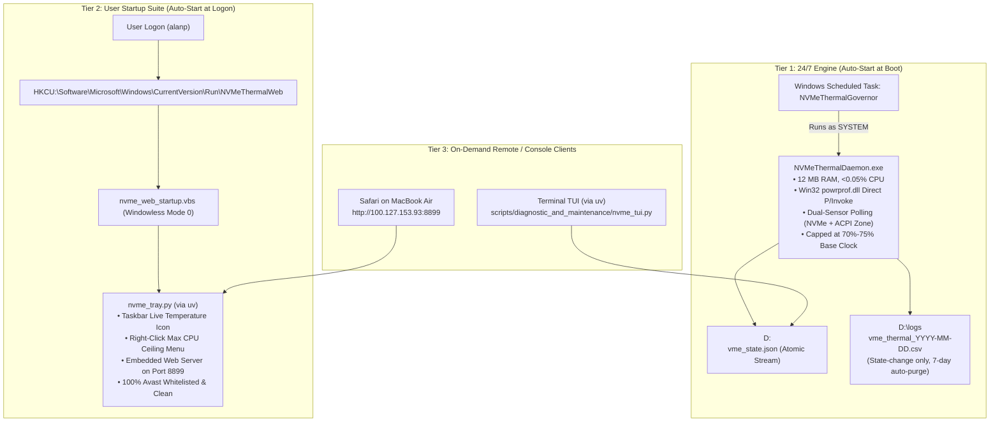

# Full Session State & Reboot Verification Checkpoint

**Host**: HP ZBook 15u G5 (`AP-HP-G5` / `alan-USB-g5`)  
**Operating System**: Windows 11 Pro 64-bit (Build 26100 / 24H2)  
**Primary SSD**: Samsung MZVLB512HAJQ-000H1 (512GB NVMe PCIe 3.0 x4)  
**Date / Checkpoint**: August 29, 2026 12:53 BST  
**Git Remote**: `https://github.com/alan-prudom/setup-usb-boot-keys.git` (Branch `main`, clean, up to date at commit `dd5142e`)  

---

## 1. System Architecture & Active Services



---

## 2. Status of All Verified Deliverables

| Deliverable / Feature | Implementation | Current Status | Git Commit |
| :--- | :--- | :--- | :--- |
| **Dual-Sensor Governor Engine** | `src/NVMeThermalDaemon.cs` $\rightarrow$ `bin/NVMeThermalDaemon.exe` | **Active / Production Ready** (12 MB RAM) | [`7395f7e`](https://github.com/alan-prudom/setup-usb-boot-keys/commit/7395f7e) |
| **24/7 Boot Auto-Start** | Windows Task Scheduler `\NVMeThermalGovernor` | **Registered (`SYSTEM`, `AtStartup`)** | [`7cafdaf`](https://github.com/alan-prudom/setup-usb-boot-keys/commit/7cafdaf) |
| **Python Taskbar Tray App** | `scripts/diagnostic_and_maintenance/nvme_tray.py` | **Verified Functional** (`pystray` + `Pillow`) | [`dd5142e`](https://github.com/alan-prudom/setup-usb-boot-keys/commit/dd5142e) |
| **Web Server (Port 8899)** | Embedded in `nvme_tray.py` & standalone in `nvme_web.py` | **Verified Functional** (Light/Dark mode toggle) | [`e6124cf`](https://github.com/alan-prudom/setup-usb-boot-keys/commit/e6124cf) |
| **User Login Auto-Start** | `nvme_web_startup.vbs` in `HKCU\...\Run` | **Configured & Tested** (Windowless background) | [`dd5142e`](https://github.com/alan-prudom/setup-usb-boot-keys/commit/dd5142e) |
| **Terminal TUI Dashboard** | `scripts/diagnostic_and_maintenance/nvme_tui.py` | **Verified Functional** (Fixed column alignment) | [`9e06fb5`](https://github.com/alan-prudom/setup-usb-boot-keys/commit/9e06fb5) |
| **Ubuntu 16 Storage Archive** | `D:\Ubuntu16_archive.tar.gz` (3.08 GB) | **Verified Intact** (Pending user deletion of `D:\Ubuntu16`) | [`d8295df`](https://github.com/alan-prudom/setup-usb-boot-keys/commit/d8295df) |
| **Investigation Logs & Specs** | `docs/session_artifacts/` & `system_investigation_and_reboot_findings.md` | **100% Synchronized & Audited** | [`100c3fb`](https://github.com/alan-prudom/setup-usb-boot-keys/commit/100c3fb) |

---

## 3. Post-Reboot Verification Steps for the User

1. **Reboot Command**:
   ```cmd
   shutdown /r /t 0
   ```
2. **After Boot (Wait 45s)**:
   * Connect via **TightVNC (`100.127.153.93:5901`)** and enter PIN.
   * Verify the **Taskbar Tray Icon** appears in the bottom-right (or in the `^` overflow menu) showing the live green temperature number (`43°`).
   * On MacBook Air, open Safari to [`http://100.127.153.93:8899`](http://100.127.153.93:8899) to view the live graphical dashboard.
3. **SSH Remote Verification**:
   ```bash
   ssh alanp@100.127.153.93
   uv run D:\Github\ap-devices-and-pcs\devices\setup-usb-boot-keys\scripts\diagnostic_and_maintenance\nvme_tui.py
   ```
