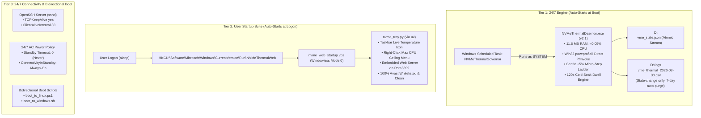

# Session State Checkpoint: August 30, 2026 (09:37 BST)

**Host**: HP ZBook 15u G5 (`AP-HP-G5` / `alan-USB-g5`)  
**Operating System**: Windows 11 Pro 64-bit (Build 26100 / 24H2)  
**Primary NVMe SSD**: Samsung MZVLB512HAJQ-000H1 (512GB PCIe 3.0 x4)  
**Prior Continuous Uptime**: **19.05 Hours (1,143 Minutes)** with **ZERO Crashes**  
**Git Remote**: `https://github.com/alan-prudom/setup-usb-boot-keys.git` (Branch `main`)  

---

## 1. System State & Services Summary Prior to Reboot



---

## 2. Key Accomplishments & Fixes Applied in this Session:

1. **Overnight Stability Verified**:
   * Machine maintained **19 continuous hours of uptime** without a single crash (`0x154` or `0xEF`), keeping NVMe temperatures between **`44°C` and `48°C`**.
2. **24/7 Always-On AC Power & Network Policy**:
   * Disabled AC standby sleep timeout (`standby-timeout-ac 0`) and enabled `ConnectivityInStandby = Always On` to prevent Windows Modern Standby from dropping SSH overnight.
3. **OpenSSH Persistent KeepAlives**:
   * Configured `ClientAliveInterval 30` and `TCPKeepAlive yes` in `C:\ProgramData\ssh\sshd_config` to eliminate router NAT idle timeouts.
4. **Registry Accessibility & Input Fixes**:
   * Disabled Windows ClickLock (`HKCU:\Control Panel\Desktop\ClickLock = 0`).
   * Disabled StickyKeys, FilterKeys, and ToggleKeys accessibility hotkeys to prevent virtual modifier key lockup.
5. **Bidirectional UEFI Boot Scripts**:
   * Deployed `scripts/diagnostic_and_maintenance/boot_to_linux.ps1` and `boot_to_windows.sh`.

---

## 3. Post-Reboot Verification Steps:

1. **Reboot Command**:
   ```cmd
   shutdown /r /t 0
   ```
2. **After Boot (Wait 45s)**:
   * Connect via **TightVNC (`100.127.153.93:5901`)** and enter PIN.
   * Verify the **Taskbar Tray Icon** appears in the bottom-right showing live temperature (`46°`).
   * Open [`http://100.127.153.93:8899`](http://100.127.153.93:8899) in Safari on MacBook Air.
