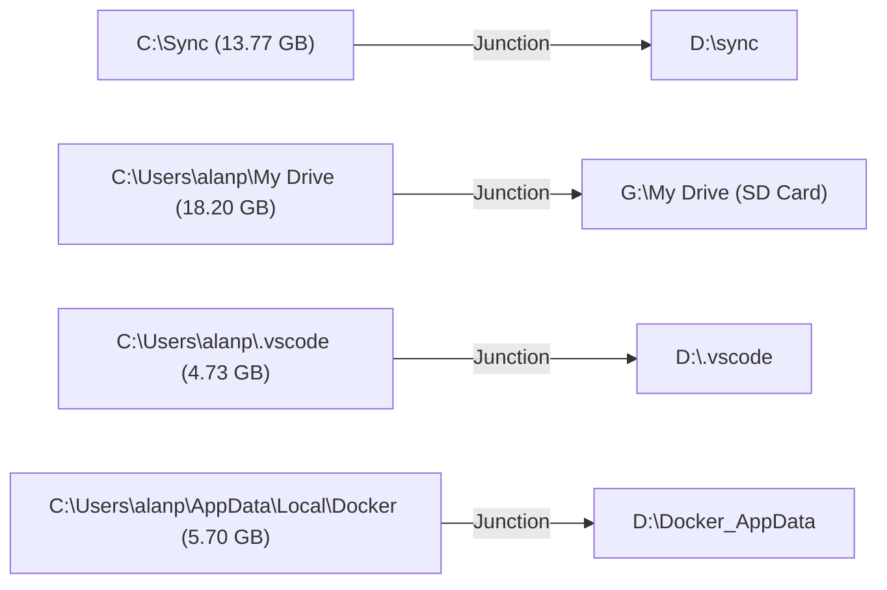

# Session Summary: System Investigation, Disk Optimization & Script Versioning

**Date**: August 28, 2026  
**System**: HP ZBook 15u G5 (`AP-HP-G5` / `alan-USB-g5`)  
**Repository**: `D:\Github\ap-devices-and-pcs\devices\setup-usb-boot-keys`  
**Git Branch**: `main` (clean, synchronized with `origin/main`)

---

## 1. Overview of Key Discussion Points

### A. Root Cause of Windows 11 Blue Screens & Unexpected Reboots
Through deep forensic queries of the Windows System Event Logs and SMART counters, five compounding root causes were analyzed:

1. **Storage Depletion on `C:`**:
   * Windows OS drive started at **3.57 GB free (1.6%)**, starving `pagefile.sys`, VSS shadow copies, and crash dump writing.
2. **Artificial 1,000 MB Pagefile Hard-Cap**:
   * `Win32_PageFileSetting` had `C:\pagefile.sys` manually locked to 1,000 MB max. When memory pressure exceeded 1 GB of paged data, Windows threw `0x154 UNEXPECTED_STORE_EXCEPTION`.
3. **Volume Shadow Storage (VSS) User-Imposed Limit**:
   * Frequent System Restore snapshots aborted with `Volsnap Event 36`, deadlocking in-flight NTFS I/O flushes.
4. **Avast Cleanup (`TuneupSvc.exe` / `AvastCleanupSvc`)**:
   * Held exclusive registry locks on the User Profile Hive (`Event 1552`) and ran multiple high-CPU background UI workers.
5. **NVMe Thermal Throttling (Hardware Root Cause)**:
   * SMART counters revealed the Samsung NVMe reached a maximum temperature of **81°C** (near emergency shutdown) with **485 ms peak read latency**.
   * Under heavy sustained load, the drive throttled throughput to near zero, causing `Storage-ATAPort Event 507` SCSI SRB request failures and kernel paging timeouts (`0x1E / 0xC0000006 STATUS_IN_PAGE_ERROR`, `0x7A`, `0x154`).
   * **NAND Health**: Confirmed healthy (`Wear: 0`, 0 uncorrectable read errors).

---

### B. High Memory Consumers Identified
* **Firefox**: Consumed **~3.3 GB of RAM** across 6 processes, driving heavy paging demands. Dropped to ~478 MB after tab reduction.
* **Dropbox**: Top remaining consumer at **1,058 MB RAM** with active background synchronization.

---

### C. Legacy Linux Installations (`D:\Ubuntu16`)
* Confirmed no `Ubuntu16` on `C:`. Located on `D:\Ubuntu16` taking **8.78 GB across 243,863 files**.
* Formulated an archiving strategy using Windows native `tar.exe` to compress the tree into `D:\Ubuntu16_archive.tar.gz` while excluding the dead socket reparse point (`Ubuntu16/fsserver`).

---

## 2. Remediations & Configuration Changes Applied

| Component | Initial State | Remediated State | Mechanism / Command |
| :--- | :--- | :--- | :--- |
| **`C:` Free Space** | 3.57 GB (1.6%) | **~17–19 GB (Dynamic) / 30.69 GB Peak** | Migrated Sync, My Drive, .vscode, Docker; cleared caches |
| **Virtual Memory** | Manual (1,000 MB hard ceiling) | **`AutomaticManagedPagefile = True`** | `wmic computersystem ... set AutomaticManagedPagefile=True` |
| **VSS Shadow Storage** | Capped / Aborting (`Event 36`) | **Uncapped to 10 GB** | `vssadmin resize shadowstorage /for=C: /on=C: /maxsize=10GB` |
| **Avast Cleanup** | Auto-start / Running / Locking hive | **Stopped & Disabled** | `sc stop AvastCleanupSvc` & `sc config AvastCleanupSvc start= disabled` |
| **Hibernation** | Enabled (10–15 GB `hiberfil.sys`) | **Disabled (`powercfg /h off`)** | Immediate disk space reclamation |
| **Tailscale VPN** | Required desktop login | **Unattended background daemon** | `tailscale.exe set --unattended` (IP: `100.127.153.93`) |
| **`agy` CLI PATH** | Missing in remote cmd/pwsh | **System-wide wrappers created** | `agy.cmd` in system PATH & PowerShell profile loaders |

---

## 3. Directory Migrations & NTFS Junctions Created

All directories were safely moved and linked via transparent NTFS junctions:

---

## 4. Summary of Repository File Changes & Version Control

### A. Core Findings Documentation
* [`system_investigation_and_reboot_findings.md`](file:///D:/Github/ap-devices-and-pcs/devices/setup-usb-boot-keys/system_investigation_and_reboot_findings.md):
  * Comprehensively updated with the full chronological log across August 27 and 28.
  * Details all 14 recorded crashes, the 5 root causes, complete SMART metrics, NTFS transaction recoveries, and network endpoints.
  * Committed in `74f5f46` and `ada37df`.

### B. Conversational Artifacts Saved as Version-Controlled Scripts
All 16 diagnostic, migration, and configuration tools were copied to [`scripts/diagnostic_and_maintenance/`](file:///D:/Github/ap-devices-and-pcs/devices/setup-usb-boot-keys/scripts/diagnostic_and_maintenance/), organized with human-friendly filenames, and indexed in [`README.md`](file:///D:/Github/ap-devices-and-pcs/devices/setup-usb-boot-keys/scripts/diagnostic_and_maintenance/README.md).

* **Committed in `4cbe613`**:
  1. `deep_storage_and_smart_diagnostic.ps1`
  2. `check_nvme_smart_reliability.ps1`
  3. `forensic_crash_log_query.ps1`
  4. `check_latest_bugchecks_and_volsnap.ps1`
  5. `check_application_hangs_and_crashes.ps1`
  6. `set_automatic_system_pagefile.ps1`
  7. `verify_volsnap_and_drive_space.ps1`
  8. `find_and_inspect_avast_services.ps1`
  9. `verify_system_memory_and_services.ps1`
  10. `setup_powershell_ssh_profile.ps1`
  11. `agy_wrapper.cmd`
  12. `audit_large_directories_c_drive.ps1`
  13. `migrate_vscode_and_docker_to_d.ps1`
  14. `migrate_syncthing_to_d.ps1`
  15. `migrate_google_drive_to_g.ps1`
  16. `archive_legacy_ubuntu16_rootfs.ps1`
  17. `README.md`

---

## 5. Outstanding Recommendations & Hardware Next Steps

1. 🔴 **NVMe Thermal Pad Replacement (High Priority)**:
   * Replace the dried-out M.2 thermal pad on the Samsung SSD with a 1mm high-conductivity pad to eliminate the 81°C thermal throttling ceiling.
2. 🟡 **Execute Ubuntu16 Archive**:
   * Run `archive_legacy_ubuntu16_rootfs.ps1` to compress `D:\Ubuntu16` and reclaim ~8.78 GB on `D:`.
3. 🟡 **Scheduled NTFS Check**:
   * Run `chkdsk C: /f` during next planned maintenance to ensure clean volume consistency following historic transaction rollbacks.
