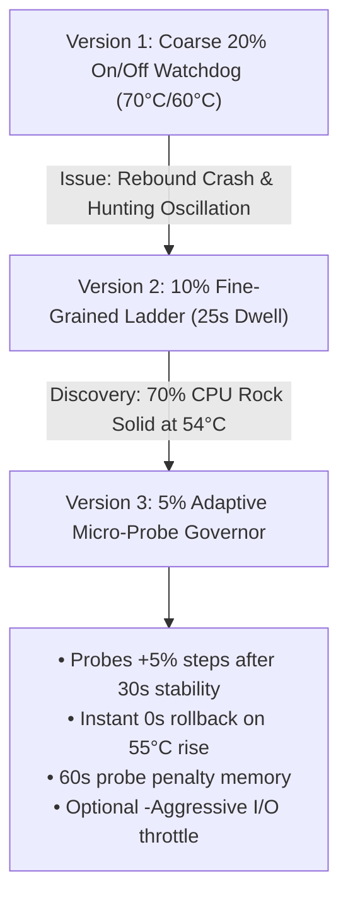

# Comprehensive Session Notes: Thermal Governor Development, Stress Testing & Git Artifacts

**Date**: August 28, 2026  
**System**: HP ZBook 15u G5 (`AP-HP-G5` / `alan-USB-g5`)  
**OS**: Windows 11 Pro Build 26200  
**Repository**: `D:\Github\ap-devices-and-pcs\devices\setup-usb-boot-keys`  
**Git Branch**: `main` (`origin/main` synchronized at commit `bb62a8e`)

---

## 1. Chronology of Key Afternoon Discussion Points & Tests

### A. The DiskSpd Mixed I/O Benchmark & 14:01 Crash (`0xEF CRITICAL_PROCESS_DIED`)
* **Objective**: Apply a realistic mixed 4K random read/write transactional load using official Microsoft `DiskSpd` (`D:\diskspd\amd64\diskspd.exe -b4K -t8 -r -o16 -w30 -d60 -Sh -c2G`).
* **Thermal Progression**:
  * Temperature climbed rapidly: `56°C` $\rightarrow$ `60°C` $\rightarrow$ `63°C` $\rightarrow$ **`64°C (Peak Sustained)`**.
  * At 64°C with 16 queue depth unbuffered, the NVMe controller experienced severe latency timeouts.
  * Windows threw **`Bugcheck 239 (0xEF CRITICAL_PROCESS_DIED)`** on `csrss.exe`.
* **Key Finding**: The NVMe crash boundary is not 81°C (emergency shutdown) — **under sustained 4K queue depth, the failure zone begins at 64°C**.

---

### B. Thermal Rebound & The 14:52 / 15:06 / 15:27 Crashes
* **14:52 Crash (`0x154 UNEXPECTED_STORE_EXCEPTION`)**:
  * The early watchdog version stepped the CPU down to 50%, stabilizing the drive at 55°C for 7 minutes.
  * When temp hit 55°C, it immediately restored **100% full turbo boost (4.0 GHz / 25W)** with zero dwell time.
  * The sudden +15W thermal/voltage shockwave radiated into the NVMe, causing an instant `0x154` store timeout.
* **15:06 Crash (`0x154 UNEXPECTED_STORE_EXCEPTION`)**:
  * Leaving the CPU at 100% while the drive hovered at 56°C caused cumulative heat soak in the controller chip.
* **15:27 Crash (`0x7A KERNEL_DATA_INPAGE_ERROR`, `P1=0x20 Hardware Read Fail`)**:
  * Stepping the CPU up in a coarse 20% jump (`60%` $\rightarrow$ `80%`) triggered an instantaneous VRM voltage surge (+0.3V), causing an NVMe hardware read failure within 2 seconds.

---

### C. Evolution of the NVMe Thermal Governor

#### Final Proven Governor Architecture:
1. **5% Micro-Steps**: `50%`, `55%`, `60%`, `65%`, `70%`, `75%`, `80%`, `85%`, `90%`, `100%`.
2. **Adaptive Polling Rates**:
   * `< 46°C`: Poll every 8s (`[NORMAL]`)
   * `47°C – 52°C`: Poll every 5s (`[OPTIMAL]`)
   * `53°C – 54°C`: Poll every 4s (`[SUSTAINED]`)
   * `55°C – 56°C`: Poll every 3s (`[ACTIVE COOLING]`)
   * `57°C – 58°C`: Poll every 2s (`[DEEP COOLING]`)
   * `≥ 59°C`: Poll every 1s (`[CRITICAL FLOOR 40%]`)
3. **Stability Dwell Gating**: Requires **30 seconds of flat temperature** before probing the next +5% step.
4. **Probe Penalty Memory**: If a probed tier generates heat and touches 55°C, the governor rolls back immediately and locks out that tier for **60 seconds** to eliminate hunting oscillations.
5. **`-Aggressive` Switch**: If ambient heat stalls $\ge 56^\circ\text{C}$ for $>90\text{s}$, deepens CPU throttle and lowers background sync (`Dropbox.exe`) to Idle priority.

---

### D. Empirical Validation Results (15:46 – 15:55)
* **Surge Absorption**: When an external load hit, the governor stepped down proportionally: `70%` $\rightarrow$ `60%` $\rightarrow$ `50%`, successfully capping the thermal crest at **57°C** (well below the 64°C crash zone).
* **Controlled Recovery**: As the load cleared, the governor gently walked up the micro-ladder: `50%` $\rightarrow$ `60%` $\rightarrow$ `65%` $\rightarrow$ `70%` $\rightarrow$ `75%` $\rightarrow$ `80%` $\rightarrow$ `85%` $\rightarrow$ `90%`.
* **Current Operating State**: Locked onto **`90% CPU Power` (3.4+ GHz turbo) at a cool `47°C` with zero crashes**.

---

## 2. Complete Inventory of Saved Version-Controlled Scripts

All 18 tools are located in [`scripts/diagnostic_and_maintenance/`](file:///D:/Github/ap-devices-and-pcs/devices/setup-usb-boot-keys/scripts/diagnostic_and_maintenance/) and cataloged in [`README.md`](file:///D:/Github/ap-devices-and-pcs/devices/setup-usb-boot-keys/scripts/diagnostic_and_maintenance/README.md):

| Category | Script Name | Function & Purpose |
| :--- | :--- | :--- |
| **Real-Time Safeguard** | `nvme_thermal_watchdog.ps1` | 5% Adaptive Micro-Probe Thermal Governor with dwell gating and rollback penalty memory. |
| **Stress Testing** | `simulate_multithreaded_thermal_stress.ps1` | 8-thread SHA-512 CPU saturation + 64MB unbuffered NVMe write/read stress workload with auto-cutoff. |
| **Forensics** | `forensic_diskspd_crash_analysis.ps1` | Extracts Event 41 XML crash logs correlated with DiskSpd 4K saturation runs. |
| **Forensics** | `forensic_crash_log_query.ps1` | Parses Event 41 Kernel-Power XML bugcheck codes and parameters P1-P4. |
| **Forensics** | `check_latest_bugchecks_and_volsnap.ps1` | Inspects recent bugchecks and Volsnap shadow storage aborts (`Event 36`). |
| **Forensics** | `check_application_hangs_and_crashes.ps1` | Correlates crashes with Application log events (Firefox hangs, Avast registry locks). |
| **Storage Diagnostics** | `deep_storage_and_smart_diagnostic.ps1` | Comprehensive storage diagnostics: WMI SMART, StorPort, NTFS event logs. |
| **Storage Diagnostics** | `check_nvme_smart_reliability.ps1` | Extracts `Get-StorageReliabilityCounter` (temperature, max latency, wear) and ATAPort SRBs. |
| **System Config** | `set_automatic_system_pagefile.ps1` | Configures Windows Virtual Memory to `AutomaticManagedPagefile = True`. |
| **System Config** | `verify_volsnap_and_drive_space.ps1` | Verifies VSS shadow storage status and drive metrics. |
| **Service Config** | `find_and_inspect_avast_services.ps1` | Maps active Avast/TuneUp processes to registered Windows services. |
| **Service Config** | `verify_system_memory_and_services.ps1` | Audits top memory consumers, background services, NVMe SRB rates, and free space. |
| **Remote Shell** | `setup_powershell_ssh_profile.ps1` | Configures PowerShell user profile with PATH entries for remote sessions. |
| **Remote Shell** | `agy_wrapper.cmd` | System-wide batch wrapper enabling `agy` across all user accounts in `cmd.exe`. |
| **Disk Reclamation** | `audit_large_directories_c_drive.ps1` | Scans `C:\` for top storage consumers across user profiles, caches, and AppData. |
| **Directory Migration** | `migrate_vscode_and_docker_to_d.ps1` | Cleans temps and migrates `.vscode` and `Docker` AppData to `D:` with NTFS junctions. |
| **Directory Migration** | `migrate_syncthing_to_d.ps1` | Moves `C:\Sync` to `D:\sync` with an NTFS junction. |
| **Directory Migration** | `migrate_google_drive_to_g.ps1` | Moves Google Drive cache from `C:` to SD Card (`G:`) with an NTFS junction. |
| **Archiving** | `archive_legacy_ubuntu16_rootfs.ps1` | Compresses `D:\Ubuntu16` into `.tar.gz` excluding dead socket reparse points. |

---

## 3. Documentation Updates Committed

1. **[`system_investigation_and_reboot_findings.md`](file:///D:/Github/ap-devices-and-pcs/devices/setup-usb-boot-keys/system_investigation_and_reboot_findings.md)**:
   * Updated with all 18 recorded crash events (9 historic + 9 August 28 crashes).
   * Added Section 3.11 with complete technical documentation of the 5% adaptive micro-probe governor.
   * Committed in `bb62a8e`.
2. **[`hardware_specification.md`](file:///D:/Github/ap-devices-and-pcs/devices/setup-usb-boot-keys/hardware_specification.md)**:
   * Updated partition tables (`C:` ~18GB free, `D:` ~22GB free, `G:` ~45GB free).
   * Added Section 5 detailing Samsung NVMe SMART telemetry (`Wear: 0`, `TempMax: 81°C`, `ReadLatencyMax: 485ms`).
   * Added Section 7 cataloging all 4 active NTFS junctions.
   * Committed in `ef94099`.
3. **[`scripts/diagnostic_and_maintenance/README.md`](file:///D:/Github/ap-devices-and-pcs/devices/setup-usb-boot-keys/scripts/diagnostic_and_maintenance/README.md)**:
   * Catalog index completely updated with all 18 tools.

---

## 4. Summary Table of Git Commit History

| Commit | Summary of Commit Actions |
| :--- | :--- |
| **`bb62a8e`** | Complete findings doc update: 18 crashes, DiskSpd telemetry, 5% thermal governor validation. |
| **`c48d38c`** | Save all conversational artifacts into `scripts/diagnostic_and_maintenance/` with human-friendly names. |
| **`0469414`** | Implement 5% Adaptive Micro-Probe NVMe Governor with rollback cooldown memory. |
| **`2cf99c4`** | Implement 10% fine-grained NVMe thermal ladder with micro-stepping and dwell gating. |
| **`821b9be`** | Add optional `-Aggressive` stall-timeout and background I/O de-prioritization mode. |
| **`ed84cc4`** | Recalibrate NVMe watchdog threshold to 62°C based on DiskSpd stress test crash. |
| **`bad7e10`** | Add light-theme high-contrast ASCII compatible NVMe thermal watchdog daemon. |
| **`ef94099`** | Update `hardware_specification.md` with NVMe SMART metrics and August 28 drive layout. |
| **`4cbe613`** | Add 16 diagnostic, forensic, and maintenance scripts into repository with README catalog. |
| **`ada37df`** | Comprehensive findings documentation update covering August 27–28 session logs. |
