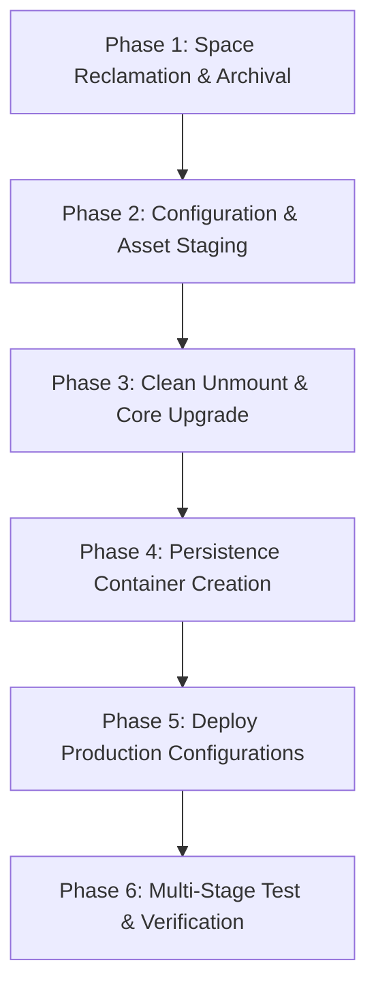

# Ventoy 2: Implementation & Verification Test Plan

**Device:** 128 GB Hybrid Multiboot USB (`/dev/sdb`)  
**Project Folder:** `devices/setup-usb-boot-keys/ventoy-2-key/`  
**Target Identity:** **Ventoy 2** (Secondary Rescue & Utility Key)  
**Primary Reference:** Ventoy 1 (documented in `Ventoy/` sub-repository)  
**Date:** September 3, 2026  

---

## 1. Objectives & Scope

1. **Reclaim Partition 1 Capacity:** Safely archive legacy ISOs (`CentOS 7` ~918 MB, `Ubuntu 20.04 Desktop` ~2.7 GB) to Partition 4 (`SHARED FAT/Archived_ISOs`), increasing free space on Partition 1 from 1.6 GB to ~5.2 GB.
2. **Non-Destructive Core Bootloader Upgrade:** Upgrade the Ventoy core bootloader on `/dev/sdb` to the latest release using `Ventoy2Disk.sh -u`, preserving all existing partitions (`sdb1`, `sdb3`, `sdb4`).
3. **Custom F6 Direct Boot Integration (`ventoy_grub.cfg`):** Replace dummy placeholders on Partition 1 with production GRUB stanzas:
   - Chainload installed Ubuntu 22.04.5 LTS on `/dev/sdb3` via filesystem UUID `e0d8ad1a-410b-4245-9192-66d2a16077b9`.
   - Direct kernel boot stanza (`/boot/vmlinuz` + `/boot/initrd.img`) as fallback.
   - Windows bootloader chainload stanza for internal drive (`/dev/sda`).
4. **Rescuezilla & Persistence Deployment:**
   - Copy the verified Rescuezilla ISO onto Partition 1.
   - Deploy a formatted 512 MB ext4 persistence overlay container (`rescuezilla-persistence.dat` labeled `casper-rw`).
   - Configure `/ventoy/ventoy.json` to map persistence and define clean menu aliases.
5. **Rigorous Verification & Test Matrix:** Multi-stage validation of filesystems, partition tables, Ventoy boot configuration, and mock boot tests.

---

## 2. Implementation Phases & Step-by-Step Execution



### Phase 1: Space Reclamation & Archival
* **Action 1.1:** Transfer `CentOS-7-x86_64-Minimal-1810.iso` (918 MB) from `/media/alan/Ventoy/` to `/media/alan/SHARED FAT/Archived_ISOs/` with checksum/size verification, then remove from `sdb1`.
* **Action 1.2:** Transfer `ubuntu-20.04.2.0-desktop-amd64.iso` (2.7 GB) to `/media/alan/SHARED FAT/Archived_ISOs/`, verify size, then remove from `sdb1`.
* **Result:** Partition 1 free space increases from 1.6 GB to ~5.2 GB.

### Phase 2: Configuration & Asset Staging in Git
* **Action 2.1:** Create git-tracked templates in `devices/setup-usb-boot-keys/ventoy-2-key/`:
  - `ventoy_grub.cfg`: Contains F6 boot stanzas customized for Ventoy 2 (`sdb3` UUID `e0d8ad1a-410b-4245-9192-66d2a16077b9`).
  - `ventoy.json`: Persistence mapping for Rescuezilla and menu aliases.
  - `upgrade_ventoy2.sh`: Automated, idempotent script encapsulating the non-destructive upgrade.
  - `verify_ventoy2.sh`: Verification script to audit partitions, MBR, and configuration integrity.

### Phase 3: Non-Destructive Core Bootloader Upgrade
* **Action 3.1:** Locate and extract latest Ventoy Linux package (e.g. `ventoy-1.0.99` or latest available).
* **Action 3.2:** Safely unmount all active `/dev/sdb` partitions (`sdb1`, `sdb2`, `sdb3`, `sdb4`) via `udisksctl unmount` or `umount`.
* **Action 3.3:** Run non-destructive update:
  ```bash
  sudo ./Ventoy2Disk.sh -u /dev/sdb
  ```
* **Safety Rules:**
  - **CRITICAL:** Ensure the `-u` flag is used (NEVER `-i`).
  - Confirm target device is strictly `/dev/sdb` (verifying model, size, and partition layout before execution).

### Phase 4: Persistence Container Creation
* **Action 4.1:** Remount `/dev/sdb1`.
* **Action 4.2:** Allocate 512 MB zeroed file on `/dev/sdb1`:
  ```bash
  dd if=/dev/zero of=/media/alan/Ventoy/rescuezilla-persistence.dat bs=1M count=512 status=progress
  ```
* **Action 4.3:** Format container as ext4 with label `casper-rw`:
  ```bash
  mkfs.ext4 -L casper-rw -F /media/alan/Ventoy/rescuezilla-persistence.dat
  ```

### Phase 5: Deploy Production Configurations & ISOs
* **Action 5.1:** Copy Rescuezilla ISO to `/media/alan/Ventoy/`.
* **Action 5.2:** Ensure `/media/alan/Ventoy/ventoy/` directory exists.
* **Action 5.3:** Deploy `ventoy_grub.cfg` and `ventoy.json` into `/media/alan/Ventoy/ventoy/` (and root of `sdb1` for legacy Ventoy compatibility).
* **Action 5.4:** Sync filesystem buffers (`sync`).

---

## 3. Comprehensive Verification & Test Plan

| Test ID | Test Category | Target Component | Procedure | Expected Result | Pass/Fail Criteria |
| :--- | :--- | :--- | :--- | :--- | :--- |
| **TC-01** | Space & Partition | `/dev/sdb1` & `/dev/sdb4` | Run `df -h` on mounted partitions. | `sdb1` has ≥ 3.5 GB free after Rescuezilla + persistence; `sdb4` contains archived ISOs. | Archived ISO file sizes match originals exactly. |
| **TC-02** | Partition Integrity | `/dev/sdb` Partition Table | Run `lsblk -o NAME,SIZE,FSTYPE,LABEL,UUID /dev/sdb`. | Partitions `sdb1` (exFAT), `sdb2` (VTOYEFI), `sdb3` (ext4), `sdb4` (FAT32) intact. UUIDs unchanged. | `sdb3` UUID strictly remains `e0d8ad1a-410b-4245-9192-66d2a16077b9`. |
| **TC-03** | MBR Boot Signature | `/dev/sdb` Sector 0 | Read first 512 bytes with `xxd` / `hexdump`. | MBR contains Ventoy boot code signature and valid partition table ending in `55 aa`. | Ventoy MBR code present; partition boundaries preserved. |
| **TC-04** | Installed OS Integrity | `/dev/sdb3` (Ubuntu 22.04) | Mount `sdb3` and run `ls -la /boot` and `cat /etc/os-release`. | Full Linux rootfs intact; kernel `vmlinuz` and `initrd.img` present and accessible. | No corruption or missing root directories. |
| **TC-05** | F6 GRUB Syntax | `ventoy_grub.cfg` | Validate GRUB configuration syntax using `grub-script-check`. | Zero syntax errors. All UUIDs match target partition. | Script parses successfully with exit code 0. |
| **TC-06** | JSON Schema | `ventoy.json` | Validate JSON structure with `python3 -m json.tool`. | Valid JSON formatting; persistence image paths match disk filenames. | Valid JSON syntax; zero parse errors. |
| **TC-07** | Persistence Mount | `rescuezilla-persistence.dat` | Mount image via loopback (`mount -o loop ... /mnt/test`), test write/read, unmount. | Container mounts cleanly as ext4 with label `casper-rw`. | Read/write test succeeds; clean unmount. |
| **TC-08** | Physical Boot Test | Hardware Startup (HP) | Boot PC from USB key (`F9` boot menu):<br>1. Main Ventoy menu displays.<br>2. Press `F6` → custom menu loads.<br>3. Select Ubuntu `sdb3` → boots directly to desktop. | Clean boot without requiring SuperGrub scanner. | Fast, direct boot into Ubuntu 22.04 desktop. |

---

## 4. Rollback & Contingency Strategy

* **Baseline Recovery:** If any partition table alteration occurs during update, the partition table and MBR can be restored directly from the Clonezilla manifest/geometry baseline recorded in `Ventoy/Ventoy_Core_Backup_2026-09-02_manifest.txt`.
* **Non-destructive Guarantee:** `Ventoy2Disk.sh -u` only touches Sector 0 and `sdb2`. If `Ventoy2Disk.sh -u` fails to execute for any reason, the existing partitions (`sdb1`, `sdb3`, `sdb4`) remain completely untouched.
