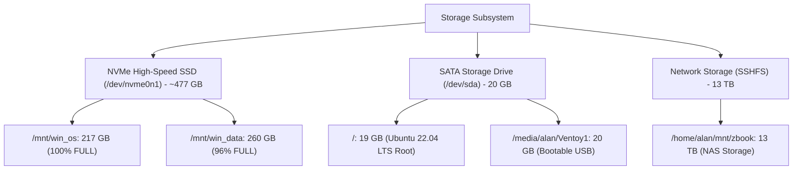

# Hardware Specification & Technical Inventory

**Host Environment**: `alan-USB-g5`  
**Date of Audit**: July 30, 2026  
**System Classification**: Mobile Workstation

---

## 1. System & Chassis Overview

| Property | Value / Specification |
| :--- | :--- |
| **Manufacturer** | HP (Hewlett-Packard) |
| **Product Model** | HP ZBook 15u G5 |
| **Form Factor** | Mobile Workstation Laptop |
| **System Architecture** | x86_64 (64-bit) |
| **BIOS / Firmware Version** | Q78 Ver. 01.31.00 |
| **Operating System** | Ubuntu 22.04.5 LTS (Jammy Jellyfish) |

---

## 2. Processor (CPU) Specifications

```
  +-------------------------------------------------------------+
  |              Intel(R) Core(TM) i7-8550U CPU                 |
  |   4 Physical Cores | 8 Logical Threads | 8 MB L3 Cache      |
  |        1.80 GHz Base Clock -> 4.00 GHz Turbo Boost          |
  +-------------------------------------------------------------+
```

| Parameter | Detailed Specification |
| :--- | :--- |
| **CPU Model** | Intel(R) Core(TM) i7-8550U CPU @ 1.80GHz |
| **Microarchitecture** | Kaby Lake R (8th Generation Core i7) |
| **Physical Cores** | 4 Cores |
| **Logical Processors (Threads)** | 8 Threads (Hyper-Threading enabled) |
| **Base Clock Speed** | 1.80 GHz |
| **Max Turbo Frequency** | 4.00 GHz |
| **L3 Cache Size** | 8192 KB (8 MB) |
| **CPU Stepping / Microcode** | Stepping 10, Microcode `0xf6` |
| **Instruction Set & Features** | AVX2, SSE4.1/4.2, AES-NI, VT-x (VMX), BMI1/BMI2, FMA3, Turbo Boost, SpeedStep |
| **Security Mitigation Flags** | PTI, IBRS, IBPB, STIBP, SSBD (Meltdown & Spectre mitigations active) |

---

## 3. System Memory (RAM)

| Parameter | Capacity / Status |
| :--- | :--- |
| **Total Physical RAM** | **16 GB** (16,218,080 KiB) |
| **Available System Memory** | ~12.4 GB |
| **Swap Space Allocated** | 900 MB (919,804 KiB) |
| **Zswap Status** | Disabled (0 KiB) |

---

## 4. Storage Subsystem & Disk Partition Layout

### Physical & Virtual Disk Inventory



| Drive / Device | Type | Mount Point | Partition Size | Used Space | Available | Usage % | Status |
| :--- | :--- | :--- | :--- | :--- | :--- | :--- | :--- |
| `/dev/nvme0n1p3` | NVMe SSD | `/mnt/win_os` | 217 GB | 216 GB | 910 MB | **100%** | **CRITICAL** |
| `/dev/nvme0n1p4` | NVMe SSD | `/mnt/win_data` | 260 GB | 248 GB | 12 GB | **96%** | **WARNING** |
| `/dev/sda3` | SATA SSD | `/` (Ubuntu Root) | 19 GB | 14 GB | 5.1 GB | **73%** | Healthy |
| `/dev/sda1` | USB Drive | `/media/alan/Ventoy1` | 20 GB | 18 GB | 1.4 GB | **94%** | Warning |
| `192.168.1.34:...` | Remote NAS | `/home/alan/mnt/zbook` | 13 TB | 11 TB | 2.2 TB | **83%** | Healthy |
| `/dev/loop0` | Virtual Loop | `/mnt/win_data/docker-data` | 20 GB | 271 MB | 19 GB | **2%** | Healthy |

---

## 5. Network Hardware & Controllers

| Interface Name | Controller Type | Hardware / Protocol Details | Status / IP Address |
| :--- | :--- | :--- | :--- |
| **`enp0s31f6`** | Physical Ethernet | Intel Gigabit Ethernet Adapter | **UP** (`192.168.1.159/24`) |
| **`wlp2s0`** | Wi-Fi Wireless | Intel Wireless Controller | **DOWN** |
| **`tailscale0`** | Virtual VPN | Tailscale WireGuard Mesh VPN | **UP** (`100.67.12.83`) |
| **`docker0`** | Virtual Bridge | Docker Container Bridge | **UP** (`172.17.0.1/16`) |

---

## 6. Summary Hardware Assessment

> [!NOTE]
> **Workstation Profile**: The **HP ZBook 15u G5** equipped with an **Intel Core i7-8550U** and **16 GB RAM** provides solid mobile workstation performance for development, software containerization, and multitasking.

> [!CAUTION]
> **Storage Bottleneck Warning**: Storage space on primary NVMe partitions (`/mnt/win_os` at **100%** and `/mnt/win_data` at **96%**) requires urgent space reallocation or cleanup to prevent write throttling or system instability.

---
*Hardware Specification Document generated automatically by Antigravity AI.*
