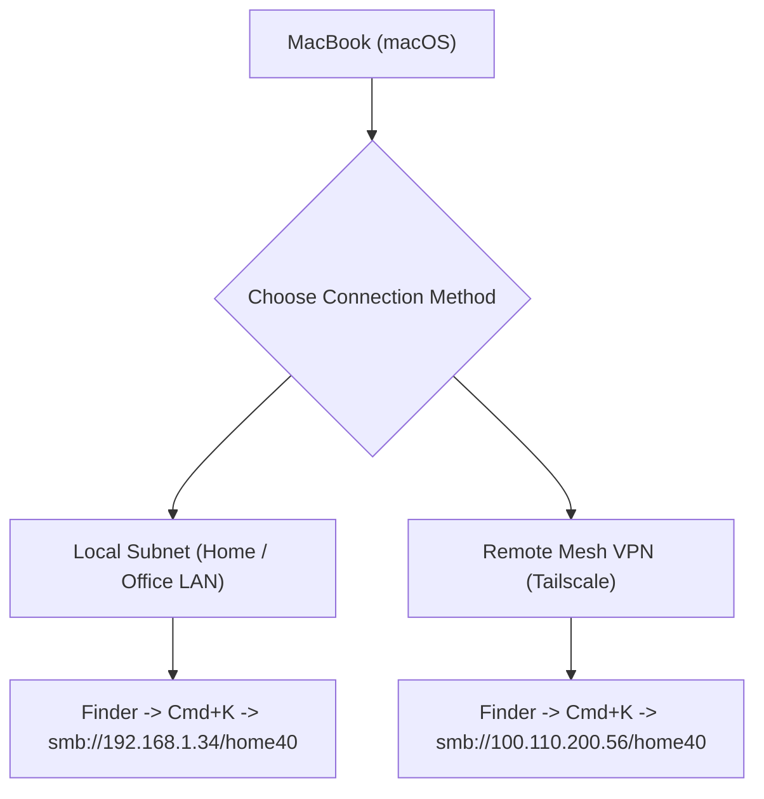

# MacBook Setup & Cross-Platform Integration Guide

**Target Environment**: macOS / MacBook  
**Target Server & Workstation**: `alan-USB-g5` (Ubuntu 22.04 LTS & Windows 11)  
**Network NAS Share**: `smb://192.168.1.34/home40` (or `smb://100.110.200.56/home40` via Tailscale)  
**Date**: August 1, 2026

---

## 1. Connecting MacBook to the 13 TB SMB NAS Server

Access your 13 TB network storage (`home40`) seamlessly from macOS over local LAN or Tailscale VPN.



### Steps to Mount in Finder:
1. Open **Finder** on your MacBook.
2. Press **`Cmd + K`** (or click top menu: **Go** $\rightarrow$ **Connect to Server...**).
3. Enter Server Address:
   * **Local LAN**: `smb://192.168.1.34/home40`
   * **Tailscale Remote**: `smb://100.110.200.56/home40`
4. Click **Connect**.
5. Log in with your network credentials and save them in your macOS Keychain.

### Auto-Mounting SMB Share at macOS Startup:
1. Open **System Settings** $\rightarrow$ **General** $\rightarrow$ **Login Items**.
2. Drag the mounted `home40` volume into the **Open at Login** list.

---

## 2. Secure Remote Desktop (VNC / Screen Sharing) from MacBook

Connect to `alan-USB-g5` desktop from your MacBook using built-in macOS **Screen Sharing** (`vnc://`).

### Method A: Secure SSH Tunneling (Recommended for Local LAN)
Because VNC on `alan-USB-g5` is bound strictly to `127.0.0.1:5902` for maximum security:

1. Open Terminal on your MacBook and start an SSH tunnel:
   ```bash
   ssh -L 5902:127.0.0.1:5902 alan@192.168.1.159
   ```
2. Open Finder on MacBook $\rightarrow$ Press **`Cmd + K`**.
3. Enter: `vnc://127.0.0.1:5902` and click **Connect**.
4. Enter your VNC password.

### Method B: Direct Connection over Tailscale VPN
If connecting over Tailscale mesh network:
1. Ensure Tailscale is active on your MacBook.
2. Open Finder $\rightarrow$ Press **`Cmd + K`**.
3. Enter: `vnc://100.67.12.83:5902` and click **Connect**.

---

## 3. SSH Key Authentication Setup for MacBook

Configure passwordless, encrypted SSH login from your MacBook to `alan-USB-g5`.

1. Open macOS Terminal and generate an Ed25519 SSH key pair (if not already created):
   ```bash
   ssh-keygen -t ed25519 -C "macbook-access"
   ```
2. Copy your MacBook SSH public key to `alan-USB-g5`:
   ```bash
   ssh-copy-id alan@192.168.1.159
   ```
3. Test SSH connection:
   ```bash
   ssh alan@192.168.1.159
   ```

---

## 4. Useful macOS Terminal Quick Configurations

Add these convenient aliases to your MacBook shell configuration (`~/.zshrc`):

```zsh
# Append to ~/.zshrc on MacBook:

# Quick SSH to Workstation
alias ssh-workstation="ssh alan@192.168.1.159"
alias ssh-tailscale="ssh alan@100.67.12.83"

# Quick SSH VNC Tunnel
alias vnc-tunnel="ssh -L 5902:127.0.0.1:5902 alan@192.168.1.159"

# Mount SMB Server via command line
alias mount-nas="open smb://192.168.1.34/home40"
```

After updating `~/.zshrc`, reload configuration:
```zsh
source ~/.zshrc
```

---

## 5. Cross-Platform File & Drive Compatibility Matrix

| File System | macOS Read | macOS Write | Linux Read | Linux Write | Notes |
| :--- | :--- | :--- | :--- | :--- | :--- |
| **SMB / Network Share** | ✅ Full | ✅ Full | ✅ Full | ✅ Full | **Recommended** for shared 13 TB NAS |
| **exFAT** | ✅ Full | ✅ Full | ✅ Full | ✅ Full | Best format for external USB drives |
| **NTFS** | ✅ Read-only | ❌ Requires driver | ✅ Full (`ntfs-3g`) | ✅ Full (`ntfs-3g`) | Windows OS partition format |
| **Ext4** | ❌ Requires driver | ❌ Requires driver | ✅ Full | ✅ Full | Native Linux root format |

---
*MacBook Setup & Integration Guide compiled by Antigravity AI for setup-usb-boot-keys.*
