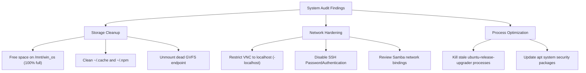

# System Audit Report: Disk Space, Software Packages & Network Security

**Date**: July 30, 2026  
**Host Environment**: `alan-USB-g5`  
**Operating System**: Ubuntu 22.04.5 LTS (Jammy Jellyfish)

---

## 1. Executive Summary

A comprehensive system audit was conducted covering **Disk Usage & Storage Health**, **Installed Software Packages**, and **Network Security & Exposure**. 

### Key Audit Findings
> [!CAUTION]
> **Critical Disk Saturation**: Partition `/mnt/win_os` (`/dev/nvme0n1p3`) is at **100% capacity** (216 GB used / 910 MB free). Partition `/mnt/win_data` (`/dev/nvme0n1p4`) is at **96% capacity** (248 GB used / 12 GB free).

> [!WARNING]
> **VNC Exposed Network-wide**: `Xtigervnc` is bound to `0.0.0.0:5902` with `-localhost=0`, exposing remote desktop access across all network interfaces instead of binding strictly to loopback (`127.0.0.1`).

> [!WARNING]
> **SSH Password Authentication Enabled**: `/etc/ssh/sshd_config` allows password-based authentication (`PasswordAuthentication yes`) on port 22, exposing the system to potential local network brute-force attempts.

---

## 2. Disk Space & Storage Audit

### Filesystem Storage Summary

| Filesystem | Mount Point | Size | Used | Avail | Use % | Status |
| :--- | :--- | :--- | :--- | :--- | :--- | :--- |
| `/dev/sda3` | `/` (Ubuntu Root) | 19 GB | 14 GB | 5.1 GB | 73% | Normal |
| `/dev/nvme0n1p3` | `/mnt/win_os` | 217 GB | 216 GB | 910 MB | **100%** | **CRITICAL** |
| `/dev/nvme0n1p4` | `/mnt/win_data` | 260 GB | 248 GB | 12 GB | **96%** | **WARNING** |
| `/dev/sda1` | `/media/alan/Ventoy1` | 20 GB | 18 GB | 1.4 GB | **94%** | **WARNING** |
| `192.168.1.34:/...` | `/home/alan/mnt/zbook` (SSHFS) | 13 TB | 11 TB | 2.2 TB | 83% | Normal |
| `/dev/loop0` | `/mnt/win_data/docker-data` | 20 GB | 271 MB | 19 GB | 2% | Normal |

### Local Linux (`/`) Folder Breakdown (Total: 9.8 GB)
* **`/usr`**: 5.5 GB (System binaries, shared libraries, desktop application packages)
* **`/home`**: 2.3 GB (User home directory storage)
  * `~/.antigravity-server`: 404 MB
  * `~/.nvm`: 392 MB
  * `~/.cache`: 376 MB
  * `~/.local`: 348 MB
  * `~/.npm`: 318 MB
  * `~/snap`: 229 MB
  * `~/.mozilla`: 226 MB
* **`/var`**: 1.1 GB (Logs, apt caches, system state)
* **`/boot`**: 94 MB

### Inode Health Audit
All filesystems have healthy inode availability (Root `/` at 20% inode usage, `/mnt/win_os` at 64% inode usage). No inode exhaustion detected.

### Mount Issues & Errors
* **Stale GVFS Mount**: `/run/user/1000/gvfs` returned `Transport endpoint is not connected`. 

---

## 3. Software Package Audit

### Package Manager Overview
* **OS Distribution**: Ubuntu 22.04.5 LTS (x86_64)
* **DEB/DPKG Installed Packages**: ~2,500+ installed system packages.
* **Snap Packages**: Active snaps managed via `/snap`.
* **Node.js Runtime Environments**: NVM (`~/.nvm`) and global NPM caches (`~/.npm`).
* **Python Runtimes**: System Python 3.10 with Ubuntu Release Upgrader utility modules.

### Background Processes & Application Health
* **Process Anomalies**: Multiple stale `ubuntu-release-upgrader` background instances are resident in memory from previous upgrade checks (pids 45053, 363209, 510195, 2305672).
* **Node / Nginx Server**: `dumb-init -- node server/server.js` running under `root` and Nginx master/worker processes running under user `alan`.

---

## 4. Network & Security Audit

### Network Interfaces
1. **`enp0s31f6`**: Primary Physical Ethernet (`192.168.1.159/24`).
2. **`tailscale0`**: Tailscale VPN Mesh Network (`100.67.12.83`, `fd7a:115c:a1e0::2e38:c53`).
3. **`docker0`**: Docker Bridge Network (`172.17.0.1/16`).
4. **`wlp2s0`**: Wireless Interface (Currently DOWN).

### Open & Listening Ports Analysis

| Port / Protocol | Bound Address | Service / Process | Exposure | Severity |
| :--- | :--- | :--- | :--- | :--- |
| **TCP 5902** | `0.0.0.0:5902`, `[::]:5902` | `Xtigervnc` (`-localhost=0`) | **Public / Local Subnet** | **HIGH** |
| **TCP 22** | `0.0.0.0:22`, `[::]:22` | OpenSSH Server (`sshd`) | Public / Subnet | **MEDIUM** |
| **TCP 80** | `*:80` | Nginx HTTP Web Server | Public / Subnet | Informational |
| **TCP 139 / 445** | `0.0.0.0:139`, `0.0.0.0:445` | Samba (SMB File Sharing) | Local Subnet | **MEDIUM** |
| **UDP 138** | `192.168.1.255:138` | NetBIOS Name Service | Local Subnet | Informational |
| **UDP 5353** | `0.0.0.0:5353` | mDNS / Avahi Service | Local Subnet | Informational |
| **TCP 631** | `127.0.0.1:631` | CUPS Print Daemon | Localhost Only | Safe |
| **TCP 39275...** | `127.0.0.1:39xxx` | AGY AI Assistant Daemon | Localhost Only | Safe |

### Security Risk Details

1. **Unrestricted VNC Listening Socket**:
   - `Xtigervnc` process is running with `-localhost=0 -rfbport 5902`.
   - This allows any machine on the local network (`192.168.1.0/24`) or VPN to attempt authentication to VNC display `:2`.
   - **Recommendation**: Restart VNC with `-localhost` or tunnel via SSH / Tailscale only.

2. **SSH Configuration & Password Authentication**:
   - `/etc/ssh/sshd_config` contains `PasswordAuthentication yes`.
   - Allows password brute-forcing if port 22 is reachable.
   - **Recommendation**: Change to `PasswordAuthentication no` and enforce SSH key authentication only (`PubkeyAuthentication yes`).

3. **Samba / SMB Network Broadcast**:
   - Ports 139 and 445 are exposed globally (`0.0.0.0`). Ensure Samba shares have strict user credentials and access controls.

---

## 5. Actionable Recommendations & Remediation Plan



### Quick Commands for Remediation

1. **Fix VNC Server Binding**:
   ```bash
   vncserver -kill :2
   vncserver :2 -localhost
   ```

2. **Clean Stale Processes**:
   ```bash
   killall check-new-release-gtk update-manager
   ```

3. **Clear Stale GVFS Mount**:
   ```bash
   umount -f /run/user/1000/gvfs 2>/dev/null
   ```

4. **Harden SSH Config**:
   Edit `/etc/ssh/sshd_config` or `/etc/ssh/sshd_config.d/`:
   ```text
   PasswordAuthentication no
   PermitRootLogin prohibit-password
   ```

---
*Report generated by Antigravity AI Agent.*
