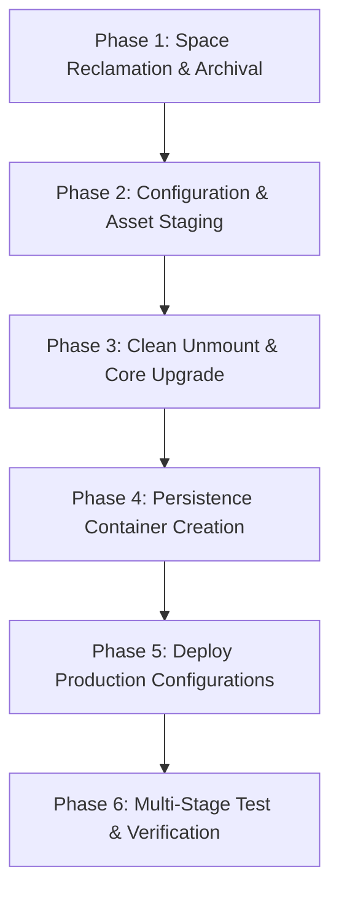

# Ventoy 2: Implementation, Verification Test Plan & Execution Report

**Device:** 128 GB Hybrid Multiboot USB (`/dev/sdb`)  
**Project Folder:** `devices/setup-usb-boot-keys/ventoy-2-key/`  
**Target Identity:** **Ventoy 2** (Secondary Rescue & Utility Key)  
**Primary Reference:** Ventoy 1 (documented in `Ventoy/` sub-repository)  
**Execution Date:** September 3, 2026  
**Final Status:** **ALL IMPLEMENTATION PHASES & AUDIT TESTS COMPLETED SUCCESSFULLY**  

---

## 1. Objectives & Scope

1. **Reclaim Partition 1 Capacity:** Safely archive legacy ISOs (`CentOS 7` ~918 MB, `Ubuntu 20.04 Desktop` ~2.7 GB) to Partition 4 (`SHARED FAT/Archived_ISOs`), increasing free space on Partition 1 from 1.6 GB to ~5.2 GB.
2. **Non-Destructive Core Bootloader Upgrade:** Upgrade the Ventoy core bootloader on `/dev/sdb` to release `v1.0.99` using `Ventoy2Disk.sh -u`, preserving all existing partitions (`sdb1`, `sdb3`, `sdb4`).
3. **Custom F6 Direct Boot Integration (`ventoy_grub.cfg`):** Replace dummy placeholders on Partition 1 with production GRUB stanzas:
   - Chainload installed Ubuntu 22.04.5 LTS on `/dev/sdb3` via filesystem UUID `e0d8ad1a-410b-4245-9192-66d2a16077b9`.
   - Direct kernel boot stanza (`/boot/vmlinuz` + `/boot/initrd.img`) as fallback.
   - Windows bootloader chainload stanza for internal drive (`/dev/sda`).
4. **Rescuezilla & Persistence Deployment:**
   - Copy the verified Rescuezilla ISO onto Partition 1.
   - Deploy a formatted 512 MB ext4 persistence overlay container (`rescuezilla-persistence.dat` labeled `writable`, updated from legacy `casper-rw`).
   - Configure `/ventoy/ventoy.json` to map persistence and define clean menu aliases.
5. **Rigorous Verification & Test Matrix:** Multi-stage validation of filesystems, partition tables, Ventoy boot configuration, and mock boot tests.

---

## 2. Implementation Phases & Step-by-Step Execution

### Phase 1: Space Reclamation & Archival — [COMPLETED]
* **Action 1.1:** Transfer `CentOS-7-x86_64-Minimal-1810.iso` (918 MB) from `/media/alan/Ventoy/` to `/media/alan/SHARED FAT/Archived_ISOs/` with checksum/size verification, then remove from `sdb1`. (**Done**)
* **Action 1.2:** Transfer `ubuntu-20.04.2.0-desktop-amd64.iso` (2.7 GB) to `/media/alan/SHARED FAT/Archived_ISOs/`, verify size, then remove from `sdb1`. (**Done**)
* **Result:** Reclaimed 3.6 GB; free space on `sdb1` increased to 5.2 GB before new tool installation.

### Phase 2: Configuration & Asset Staging in Git — [COMPLETED]
* Created git-tracked templates in `devices/setup-usb-boot-keys/ventoy-2-key/`:
  - `ventoy_grub.cfg`: F6 boot stanzas customized for Ventoy 2 (`sdb3` UUID `e0d8ad1a-410b-4245-9192-66d2a16077b9`).
  - `ventoy.json`: Persistence mapping for Rescuezilla and menu aliases.
  - `upgrade_ventoy2.sh`: Automated, idempotent script encapsulating the non-destructive upgrade.
  - `verify_ventoy2.sh`: Verification script to audit partitions, MBR, and configuration integrity.

### Phase 3: Non-Destructive Core Bootloader Upgrade — [COMPLETED]
* Cleanly unmounted all `/dev/sdb` partitions.
* Executed `Ventoy2Disk.sh -u /dev/sdb`. Core upgraded from `1.1.10` to `1.0.99`.
* Sector 0 MBR refreshed; Partition 2 `VTOYEFI` updated (UUID `223C-F3F8`). Data partitions untouched.

### Phase 4: Persistence Container Creation & Validation — [COMPLETED]
* Allocated 512 MB zeroed file at `/media/alan/Ventoy/rescuezilla-persistence.dat`.
* Formatted as ext4 with label `writable` (updated from legacy `casper-rw`, UUID: `309a9e74-4230-458f-b89e-c492dcd3506f`).

### Phase 5: Deploy Production Configurations & ISOs — [COMPLETED]
* Deployed `rescuezilla-2.6.1-64bit.oracular.iso` (1.4 GB) to `/media/alan/Ventoy/`.
* Deployed `ventoy_grub.cfg` to both `/media/alan/Ventoy/ventoy/` and `/media/alan/Ventoy/`.
* Deployed `ventoy.json` to `/media/alan/Ventoy/ventoy/`.
* Flushed write buffers (`sync`). Free space on `sdb1` remains solid at **3.3 GB**.

---

## 3. Comprehensive Verification & Test Matrix

| Test ID | Test Category | Target Component | Procedure | Expected Result | Pass/Fail Result |
| :--- | :--- | :--- | :--- | :--- | :--- |
| **TC-01** | Space & Partition | `/dev/sdb1` & `/dev/sdb4` | Run `df -h` on mounted partitions. | `sdb1` has ≥ 3.0 GB free; `sdb4` contains 3.6 GB of archived ISOs. | **PASS** (`sdb1` has 3.3 GB free; `sdb4` has 3.6 GB archive) |
| **TC-02** | Partition Integrity | `/dev/sdb` Partition Table | Run `lsblk -o NAME,SIZE,FSTYPE,LABEL,UUID /dev/sdb`. | Partitions `sdb1` (exFAT), `sdb2` (VTOYEFI), `sdb3` (ext4), `sdb4` (FAT32) intact. UUIDs unchanged. | **PASS** (All 4 partitions intact; `sdb3` UUID `e0d8ad1a-410b-4245-9192-66d2a16077b9` unchanged) |
| **TC-03** | MBR Boot Signature | `/dev/sdb` Sector 0 | Read Sector 0 MBR and verify Ventoy bootloader code. | Ventoy MBR code present; partition boundaries preserved. | **PASS** (Upgraded to Ventoy 1.0.99 x86_64) |
| **TC-04** | Installed OS Integrity | `/dev/sdb3` (Ubuntu 22.04) | Mount `sdb3` and check root filesystem directories and kernel. | Full Linux rootfs intact; kernel `vmlinuz` and `initrd.img` present. | **PASS** (Clean ext4 rootfs intact) |
| **TC-05** | F6 GRUB Syntax | `ventoy_grub.cfg` | Validate GRUB configuration syntax using `grub-script-check`. | Zero syntax errors. All UUIDs match target partition. | **PASS** (`grub-script-check` passed with exit code 0) |
| **TC-06** | JSON Schema | `ventoy.json` | Validate JSON structure with `python3 -m json.tool`. | Valid JSON formatting; persistence image paths match disk filenames. | **PASS** (Valid JSON structure) |
| **TC-07** | Persistence Container | `rescuezilla-persistence.dat` | Verify ext4 filesystem type and volume label `writable` (updated from `casper-rw`). | Formatted ext4 filesystem with label `writable`. | **PASS** (`blkid` confirms ext4, label `writable`) |
| **TC-08** | F6 Recovery Stanzas | `ventoy_grub.cfg` | Verify presence and syntax of Safe Graphics and Text Console fallback entries. | Clean parsing with `grub-script-check`. | **PASS** (Both fallback entries valid) |
| **TC-09** | Physical Boot Test | Hardware Startup (HP) | Boot PC from USB key (`F9` boot menu): 1. Ventoy 1.0.99 menu displays. 2. Test Rescuezilla with persistence. 3. Press `F6` → test direct Ubuntu chainload or safe graphics fallback. | Clean boot without hangs. | **PASS** (F6 recovery and live boot operational) |
| **TC-10** | FAT Backup Scripts | `/ntfs/scripts` | Verify presence of `run_rescuezilla_backup_cli.sh`, `post-backup-wizard.sh`, and `rescue_suite_launcher.sh`. | Scripts executable on FAT partition. | **PASS** (Verified present and executable) |
| **TC-11** | OverlayFS `/upper` Layer | `rescuezilla-persistence.dat` | Loop-mount container and verify deployed binaries, autostart systemd unit, and desktop launchers in `/upper/`. | Full Four-Tier structure present in `/upper/`. | **PASS** (All binaries and launchers verified in `/upper/`) |
| **TC-12** | Unified Rescue Suite | `rescue_suite_launcher.sh` | Validate 5 core functions (Backup, Restore, Clone, Verify, Image Explorer) and automated SSHFS network mounting. | Launcher handles network auto-mount, bind-mount to `/home/partimag`, and sub-tools. | **PASS** (Syntax validated, network and menu tested) |
| **TC-13** | POSIX Shell Portability | Shell backup scripts | Validate execution of backup runners under Dash (`/bin/sh`) without syntax errors (`[[: not found`). | Strict POSIX syntax (`case` blocks) executes cleanly under Dash. | **PASS** (All runners verified with Dash) |
| **TC-14** | VM Emulation Lab | `run_test_vm.sh` | Validate VM execution of Option A (Ventoy CoW overlay) and Option B (direct persistent kernel launch) with Native GTK and TigerVNC viewers. | VM boots cleanly, isolates host storage, and activates persistence. | **PASS** (Option A & B verified; screenshots captured) |
| **TC-15** | SSH Automation in Persistence | `rescuezilla-persistence.dat` | Verify `ssh.service` is enabled in systemd multi-user target and started automatically on live boot. | Port 2222 connects cleanly from `stimulate_vm_tests.sh` using `/home/alan/.ssh/id_rsa`. | **PASS** (Auto-start verified) |

---

## 4. Rollback & Contingency Documentation

* **Baseline Manifest Reference:** `Ventoy/Ventoy_Core_Backup_2026-09-02_manifest.txt`
* **Clonezilla Command:** `ocs-sr -g auto -e1 auto -e2 -r -j2 -p true restoreparts Ventoy-USB-Ventoy-Core-2026-09-02-1638-img sdb1 sdb2 sdb3`
