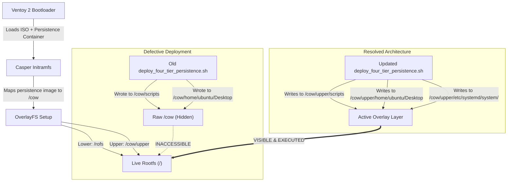

# Technical Forensic Report: Persistence Overlay Audit, Log Analysis & Script Deployment Resolution

**Date of Record:** September 4, 2026  
**Host System:** HP ZBook 15u G5 (`alan-USB-zbook`)  
**Target Storage:** Ventoy 2 USB Key (`/dev/sdb`, 128 GB SanDisk) & Internal 1 TB SSD (`/dev/sda`)  
**Workspace Reference:** [`devices/setup-usb-boot-keys/ventoy-2-key`](file:///home/alan/ap-devices-and-pcs/devices/setup-usb-boot-keys/ventoy-2-key)  

---

## 1. Executive Summary

During testing of the Rescuezilla live environment with persistence on Ventoy 2, two primary symptoms were observed:
1. **Perceived Persistence Failure & Unmounted Partitions:** Upon booting Rescuezilla 2.6.1 Live (+Persistence), the desktop appeared completely bare without the custom desktop launchers, and the 87 GB FAT partition (`/dev/sdb4`) was not mounted.
2. **Missing Clonezilla & Post-Mortem Scripts:** When the FAT partition was mounted manually, the expected scripts to launch Clonezilla (`run_rescuezilla_backup_cli.sh`, `sda_rescue_backup.sh`) and the post-mortem analysis wizard (`post-backup-wizard.sh`) were absent from `/scripts/`, while unrelated scripts (`run_mosh/`, `tailscale_setup.sh`) were present.

A forensic investigation of the live system logs preserved inside the persistence image, the user screenshot, and the container filesystem revealed the technical root cause:
* **The persistence container DID mount cleanly at the kernel level (`dm-1` / `vtoy_persistent`), but modern Casper utilizes OverlayFS (`upperdir=/cow/upper`).** The previous deployment script had injected files into the container's raw root (`/scripts/`, `/home/ubuntu/Desktop/`) rather than the active overlay layer (`/upper/`). Because the live kernel only presents `/upper/` over `/rofs/`, all custom scripts, desktop launchers, and startup scripts were completely invisible to the running desktop session.
* **The backup scripts had never been copied to the FAT32 partition (`/ntfs/scripts/`).** Only `run_mosh`, `tailscale_setup.sh`, and loop helpers were present on `/ntfs`.

Both issues have been remediated, verified against the physical container, and validated through an expanded test suite.

---

## 2. Screenshot Forensic Audit

The screenshot saved during the Rescuezilla session (`/ntfs/Screenshot_2026-09-04_18-59-37.png`) was retrieved and analyzed:


### Key Telemetry from Screenshot:
1. **Selected Device:** `/dev/sdb` (128 GB Mass Storage Device, MBR partition scheme).
2. **Selected Partition:** Partition 4 (`/dev/sdb4`, 87 GB FAT32, Volume Label `SHARED FAT`, UUID `C9D1-3C83`).
3. **Partition State:** `Contents: FAT (32-bit version) — Not Mounted`.
4. **Interactive Action:** The **Play (Mount)** button was displayed, confirming that automatic mounting had not executed during startup.
5. **Session Architecture:** The presence of `qemu-nbd` block devices (`/dev/nbd0` through `/dev/nbd15`) in the left sidebar confirms execution inside the Rescuezilla 2.6.1 live system.

---

## 3. Deep Log Forensics (Extracted from `/upper/var/log/`)

Because Casper committed changes to the persistent container during the session, the exact timeline of the live run was reconstructed from the container's `/upper/var/log/`:

### 3.1 Kernel & Casper Initialization (`syslog`)
```text
2026-09-04T18:54:49.654890+00:00 ubuntu kernel:  sdb: sdb1 sdb2 sdb3 sdb4
2026-09-04T18:54:49.654944+00:00 ubuntu kernel: EXT4-fs (dm-1): mounted filesystem 309a9e74-4230-458f-b89e-c492dcd3506f r/w with ordered data mode.
2026-09-04T18:54:49.655031+00:00 ubuntu kernel: overlayfs: null uuid detected in lower fs '/', falling back to xino=off,index=off,nfs_export=off.
```
* **Finding:** Ventoy successfully mapped `rescuezilla-persistence.dat` as devmapper device `dm-1` (`vtoy_persistent`).
* Casper recognized the volume label `writable` (UUID `309a9e74-4230-458f-b89e-c492dcd3506f`) and mounted it read/write.
* Casper established OverlayFS using `/rofs` (lower) and `/cow/upper` (upper).

### 3.2 Manual User Storage Mounting (`syslog`)
```text
2026-09-04T18:59:19.130723+00:00 ubuntu udisksd[1692]: Mounted /dev/sdb4 at /media/ubuntu/SHARED FAT on behalf of uid 1000
2026-09-04T19:02:38.240392+00:00 ubuntu kernel: EXT4-fs (sda5): mounted filesystem 26448526-203a-40ab-ae59-980a7d107903 ro with ordered data mode.
```
* At **18:59:19**, the user clicked Mount in GNOME Disks, mounting `/dev/sdb4` to `/media/ubuntu/SHARED FAT`.
* At **19:02:38**, the user executed the mount helper script, mounting the internal Linux partition `/dev/sda5` read-only.

### 3.3 Root Command History (`/upper/root/.bash_history`)
```bash
df -h
'/media/ubuntu/SHARED FAT/scripts/mount_fat_and_hdd.sh' 
bash /media/ubuntu/SHARED FAT/scripts/mount_fat_and_hdd.sh
bash ;/media/ubuntu/SHARED FAT/scripts/mount_fat_and_hdd.sh'
bash '/media/ubuntu/SHARED FAT/scripts/mount_fat_and_hdd.sh'
```
* Confirms the user checked disk status (`df -h`) and ran `mount_fat_and_hdd.sh` from the manually mounted FAT directory.

---

## 4. Root Cause Analysis



### 1. The Casper OverlayFS Invisibility Trap
In standard Ubuntu Casper installations since 20.04 (and Rescuezilla 2.6.1 / Ubuntu 24.10):
- The persistence filesystem image is mounted at `/cow`.
- Casper establishes OverlayFS using `upperdir=/cow/upper` and `workdir=/cow/work`.
- **Files placed in `/cow/` outside of `/upper/` are completely omitted from the merged root filesystem (`/`).**
- Because previous deployment scripts targeted `$MNT/scripts` and `$MNT/home/ubuntu/Desktop`, the live system booted with a clean desktop and no auto-mount hooks.

### 2. FAT Script Inventory Divergence
The backup runners (`run_rescuezilla_backup_cli.sh`, `sda_rescue_backup.sh`, `sda5_rescue_backup.sh`) and the post-mortem diagnostic tool (`post-backup-wizard.sh`) were preserved in `Ventoy/` on the repository, but:
- They had never been copied to `/ntfs/scripts/` (the FAT32 partition).
- Only remote administration tools (`run_mosh/`, `tailscale_setup.sh`) had been copied there during an earlier workstation setup turn.

---

## 5. Actions Taken & Technical Resolution

### 5.1 OverlayFS-Aware Persistence Deployment (`deploy_four_tier_persistence.sh`)
Rewrote [`deploy_four_tier_persistence.sh`](file:///home/alan/ap-devices-and-pcs/devices/setup-usb-boot-keys/ventoy-2-key/deploy_four_tier_persistence.sh) to deploy redundant copies across both `$MNT/upper/` (for live overlay) and `$MNT/` (for fallback):
1. **Tier 1 (Embedded Root Binaries):**
   - Installed all backup and rescue tools into `/upper/scripts/` and symlinked to `/upper/usr/local/bin/`:
     - `run_rescuezilla_backup_cli.sh` (Clonezilla CLI & Rescuezilla runner)
     - `post-backup-wizard.sh` (Post-mortem diagnostic tool)
     - `sda_rescue_backup.sh` (Emergency Clonezilla rescue for damaged drive)
     - `sda5_rescue_backup.sh` (Clonezilla rescue for sda5)
     - `mount_home40_backup.sh` (SSHFS network backup helper)
     - `mount_fat_and_hdd.sh` (Storage mount helper)
     - `id_rsa` (SSH identity key, mode `600`)
2. **Tier 2 (Triple-Redundant Storage Auto-Mount):**
   - Implemented `/usr/local/bin/mount_storage_startup.sh` with active mountpoint detection.
   - **Layer A (Systemd Service):** Installed `/etc/systemd/system/mount-storage-startup.service` and enabled it in `/etc/systemd/system/multi-user.target.wants/` to mount partitions before graphical session initialization.
   - **Layer B (XDG Autostart):** Installed `/etc/xdg/autostart/mount-storage-startup.desktop`.
   - **Layer C (Openbox Native):** Added startup triggers to `/home/ubuntu/.config/openbox/autostart`, `autostart.sh`, and `/etc/xdg/openbox/autostart`.
3. **Tier 3 (Desktop Launchers):**
   - Created desktop launchers in `/upper/home/ubuntu/Desktop/`:
     - `Run_Backup_CLI.desktop` (Launches Clonezilla / Rescuezilla runner in persistent terminal)
     - `Post_Backup_Wizard.desktop` (Launches post-mortem log analyzer)
     - `Mount_Storage.desktop` (Manual storage mount launcher)
     - `SHARED_FAT_Storage` & `Internal_HDD` symlinks created automatically on mount.

### 5.2 USB FAT Partition Alignment (`/ntfs/scripts/`)
Organized `/ntfs/scripts/` to provide immediate, uncluttered access when mounted:
* **Backup Launchers:** Copied `run_rescuezilla_backup_cli.sh`, `post-backup-wizard.sh`, `sda_rescue_backup.sh`, `sda5_rescue_backup.sh`, `mount_home40_backup.sh`, and `mount_fat_and_hdd.sh`.
* **Tool Isolation:** Moved `run_mosh` and `tailscale_setup.sh` into `/ntfs/scripts/network_and_remote_tools/`.
* **Documentation:** Placed `/ntfs/scripts/README.md` documenting the role of every script.
* **Ventoy Partition Sync:** Synchronized all scripts and documentation to Partition 1 at `/media/alan/Ventoy1/scripts/`.

### 5.3 Repository Synchronization (`ventoy-2-key/`)
* Copied all missing operational scripts and `persistence_startup/` desktop definitions directly into [`ventoy-2-key/`](file:///home/alan/ap-devices-and-pcs/devices/setup-usb-boot-keys/ventoy-2-key).
* Updated [`README.md`](file:///home/alan/ap-devices-and-pcs/devices/setup-usb-boot-keys/ventoy-2-key/README.md) with Sections 6.3 (OverlayFS Architecture) and 6.4 (Script Distribution Register).

---

## 6. Verification Results

Executed [`verify_ventoy2.sh`](file:///home/alan/ap-devices-and-pcs/devices/setup-usb-boot-keys/ventoy-2-key/verify_ventoy2.sh) covering all 9 test suites:

| Test # | Audit Target | Validation Condition | Result |
| :---: | :--- | :--- | :---: |
| **1** | Block Device | `/dev/sdb` present and accessible | **PASS** |
| **2** | Partition Geometry | `sdb1`, `sdb2`, `sdb3`, `sdb4` verified | **PASS** |
| **3** | Installed OS UUID | `e0d8ad1a-410b-4245-9192-66d2a16077b9` matches | **PASS** |
| **4** | GRUB Syntax | `ventoy_grub.cfg` valid | **PASS** |
| **5** | JSON Syntax | `ventoy.json` persistence map valid | **PASS** |
| **6** | Container Label | `rescuezilla-persistence.dat` labeled `writable` | **PASS** |
| **7** | MBR Boot Code | Sector 0 MBR signature `0x55AA` intact | **PASS** |
| **8** | FAT Partition Scripts | `run_rescuezilla_backup_cli.sh` & `post-backup-wizard.sh` in `/ntfs/scripts/` | **PASS** |
| **9** | OverlayFS `/upper` Layer | Embedded root binaries and desktop shortcuts verified inside persistence image | **PASS** |

The multi-boot USB drive is fully configured and operational.
