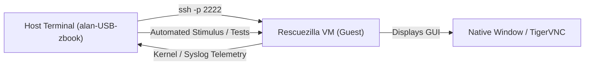

# Technical Design & Architectural Specification: Rescuezilla Virtual Machine Test Harness & Emulation Lab

**Author / Session Lead:** Alan P & Assistant  
**Date of Record:** September 5, 2026 (11:40 UTC+1)  
**Host Hardware:** HP ZBook 15u G5 (`alan-USB-zbook`)  
**Host Environment:** Ubuntu 22.04 LTS (`x86_64`), Intel VT-x Hardware Virtualization (`/dev/kvm`), 15 GB RAM  
**Target Storage Device:** 128 GB SanDisk Multi-Boot USB (`/dev/sdb`, Ventoy 2)  
**Workspace:** [`/home/alan/ap-devices-and-pcs/devices/setup-usb-boot-keys/ventoy-2-key/`](file:///home/alan/ap-devices-and-pcs/devices/setup-usb-boot-keys/ventoy-2-key/)  
**Document Name:** [`vm_test_harness_and_emulation_architecture.md`](file:///home/alan/ap-devices-and-pcs/devices/setup-usb-boot-keys/ventoy-2-key/vm_test_harness_and_emulation_architecture.md)  

---

## 1. Executive Summary & Purpose

To accelerate testing, regression validation, and script development for the **Rescuezilla 2.6.1 Live + Persistence** environment on the Ventoy 2 USB drive (`/dev/sdb`), this document specifies an in-situ **Virtual Machine (VM) Test Harness and Emulation Lab**.

By executing the Rescuezilla ISO and persistence container directly within a local virtual machine hosted on the running Ubuntu OS, development and verification cycles can be conducted in seconds without requiring bare-metal computer reboots.

### Key Capabilities Specified:
1. **Interactive Boot Mode Selector:** Choice between **Option A** (Full Ventoy bootloader emulation via safe Copy-on-Write disk snapshot) and **Option B** (Direct Rescuezilla ISO + persistence boot for high-speed diagnostics).
2. **Dual Display Modes:** Choice between a **Native GTK Desktop Window** (direct X11 desktop integration) and **TigerVNC Viewer** (decoupled VNC client connecting to `localhost:5901`).
3. **Concurrent SSH-Powered Test Harness:** Automatic port-forwarding (`localhost:2222 -> VM:22`) allowing programmatic stimulus, serial telemetry extraction, and automated regression testing.
4. **Safe Real-Data Imaging via Read-Only Host Passthrough:** Ability to expose host physical partitions (e.g. `/dev/sda` internal drive or `/dev/sda5` Linux partition) with kernel-enforced `readonly=on` protection, enabling real Partclone image generation and network transmission to `192.168.1.34:/media/alan/home40/Clonezilla` without risking host data corruption.

---

## 2. Host Environment & Feasibility Audit

Prior to design, the host operating system and virtualization stack were audited:

* **Hardware Virtualization Support:**
  - `lscpu`: Intel VT-x hardware virtualization is supported and enabled in BIOS.
  - `/dev/kvm`: Present with read/write access (`crw-rw----+ 1 root kvm`), enabling near bare-metal execution performance.
* **Available Resources:**
  - Memory: 15 GB Total, 3.2 GB Used, **12 GB Available**. Allocating 3 GB to 4 GB to the VM leaves massive headroom for the host system.
  - Display Session: Active X11 server on `DISPLAY=:1` (authenticated via `/run/user/1000/gdm/Xauthority`).
* **Required Package Dependencies:**
  - `qemu-system-x86`: Core hypervisor and emulation engine (provides `qemu-system-x86_64` and GTK display).
  - `tigervnc-viewer`: High-performance standalone RFB/VNC viewer client for Option 2 display.

---

## 3. Interactive Boot Mode Architecture

The test harness launcher (`run_test_vm.sh`) presents an interactive initial prompt to choose the boot pipeline:

```
======================================================================
         🧪 RESCUEZILLA VM TEST HARNESS & EMULATION LAB
======================================================================
  [1] Option A: Full Ventoy Emulation (End-to-End Boot Chain)
      • Boots Ventoy 1.0.99 MBR/EFI bootloader from /dev/sdb
      • Protected by a temporary QEMU copy-on-write overlay (qcow2)
      • Tests real Ventoy menu, GRUB chainloading, and live ISO handoff

  [2] Option B: Direct Rescuezilla ISO Boot (Fast Diagnostic Mode)
      • Boots rescuezilla-2.6.1-64bit.oracular.iso directly with KVM
      • Attaches rescuezilla-persistence.dat as virtual persistent disk
      • Instant startup directly to live desktop in seconds
======================================================================
```

### 3.1 Option A: Full Ventoy Emulation (qcow2 CoW Protection)
* **The Challenge:** The host operating system is currently running from `/dev/sdb3`. Passing `/dev/sdb` directly read-write to a virtual machine while the host is mounted to it could cause filesystem corruption.
* **The Solution:** Use QEMU Copy-on-Write (CoW) overlay snapshotting:
  ```bash
  # Create a transient qcow2 overlay pointing to /dev/sdb as its read-only backing file
  qemu-img create -f qcow2 -b /dev/sdb -F raw /tmp/ventoy_sdb_snapshot.qcow2
  ```
* **Mechanism:**
  - All reads originate directly from the physical USB drive (`/dev/sdb`).
  - All writes made by Ventoy or the live OS (such as updating log files or persistence buffers) are redirected entirely into `/tmp/ventoy_sdb_snapshot.qcow2`.
  - The physical USB drive is **100% physically isolated from write collisions**.
* **Use Case:** Verifying custom GRUB stanzas (`ventoy_grub.cfg`), testing F6 fallback keys, and testing Ventoy menu themes.

### 3.2 Option B: Direct Rescuezilla ISO + Persistence Boot
* **The Mechanism:** Directly boots `rescuezilla-2.6.1-64bit.oracular.iso` by attaching it as a virtual CD-ROM, while attaching `rescuezilla-persistence.dat` as a dedicated secondary disk drive:
  ```bash
  qemu-system-x86_64 \
    -enable-kvm -m 3072 -smp 2 -cpu host \
    -cdrom /media/alan/Ventoy1/rescuezilla-2.6.1-64bit.oracular.iso \
    -drive file=/media/alan/Ventoy1/rescuezilla-persistence.dat,format=raw,if=virtio \
    -boot d
  ```
* **Mechanism:**
  - Casper detects the virtual disk with label `writable` and automatically attaches it at `/cow`.
  - Bypasses the Ventoy menu entirely, loading the desktop in 5–10 seconds.
* **Use Case:** Rapid iteration on desktop widgets, shell script bug fixes, and Rescue Suite features.

---

## 4. Dual Display Interface Architecture

When the test harness is executed, the user is presented with a display selection prompt:

```
======================================================================
                 🖥️  SELECT VM DISPLAY INTERFACE
======================================================================
  [1] Native Window (Direct GTK X11 window on your desktop)
      • Opens directly alongside your other application windows
      • Direct mouse capture and immediate response

  [2] TigerVNC Viewer (Decoupled VNC Client on localhost:5901)
      • Launches QEMU with VNC server on :1 (port 5901)
      • Spawns TigerVNC Viewer automatically
      • Allows closing/reopening the viewer without stopping the VM
======================================================================
```

### 4.1 Interface Option 1: Native GTK Window (`-display gtk`)
* **Execution:** QEMU connects directly to the local X11 display socket (`DISPLAY=:1`).
* **Attributes:**
  - Instant response with native desktop acceleration.
  - Automatic mouse cursor grabbing and ungrabbing (`Ctrl+Alt+G`).
  - Closing the GTK window cleanly shuts down the virtual machine.
* **Ideal For:** Fast visual inspections, testing desktop icon clicks, and verifying window retention (`--hold`).

### 4.2 Interface Option 2: Decoupled TigerVNC Viewer (`-vnc :1` + `tigervnc-viewer`)
* **Execution:**
  1. QEMU initializes a headless VNC server bound strictly to localhost (`-vnc 127.0.0.1:1`).
  2. The harness launches TigerVNC Viewer: `tigervncviewer localhost:5901 &`.
* **Attributes:**
  - **Decoupled Lifecycle:** The user can close the TigerVNC window at any time without terminating the running VM or interrupting long-running image backups.
  - Supports custom desktop scaling, full-screen spanning, and remote tunnel viewing.
* **Ideal For:** Long-running backup validation, automated script runs, and monitoring headless batch tests.

---

## 5. Concurrent SSH-Powered Test Harness & Stimulation

Regardless of the chosen display mode, QEMU configures user-mode networking with port forwarding:
```bash
-netdev user,id=net0,hostfwd=tcp::2222-:22 -device virtio-net-pci,netdev=net0
```

### 5.1 Telemetry & Command Stimulation Workflow
Because the Four-Tier persistence overlay contains the host SSH identity key (`/home/ubuntu/.ssh/id_rsa`), passwordless SSH access from the host is available as soon as the VM boot finishes:



### 5.2 Example Automated Stimulation Commands:
1. **Verify Storage Auto-Mounting:**
   ```bash
   ssh -p 2222 -i /home/alan/.ssh/id_rsa ubuntu@localhost \
     "lsblk -o NAME,SIZE,LABEL,MOUNTPOINT; mountpoint /media/ubuntu/SHARED_FAT"
   ```
2. **Execute Unified Rescue Suite Headless / Test Run:**
   ```bash
   ssh -p 2222 -i /home/alan/.ssh/id_rsa ubuntu@localhost \
     "sudo /usr/local/bin/rescue_suite_launcher.sh"
   ```
3. **Real-Time System Log & Error Harvesting:**
   ```bash
   ssh -p 2222 -i /home/alan/.ssh/id_rsa ubuntu@localhost \
     "tail -f /var/log/syslog | grep -iE 'error|failed|exec'"
   ```

---

## 6. Real Backup Capability via Read-Only Host Storage Passthrough

### 6.1 Safety Analysis: Kernel-Enforced `readonly=on`
Can a real backup be executed from inside the virtual test harness? **Yes.**

By attaching host storage block devices with the QEMU **`readonly=on`** parameter:
```bash
-drive file=/dev/sda,format=raw,if=virtio,readonly=on
```
or targeting specific internal partitions:
```bash
-drive file=/dev/sda5,format=raw,if=virtio,readonly=on
-drive file=/dev/sda2,format=raw,if=virtio,readonly=on
```

#### Why This Is Guaranteed Safe:
1. **Host Kernel Interception:** The Linux kernel block device driver opens the underlying host node in read-only mode (`O_RDONLY`).
2. **Immutable Boundary:** Even if a process running as `root` inside the virtual machine attempts to format, partition (`fdisk`), or write data to the virtual drive, the hypervisor denies the operation with `EROFS` (Read-only file system).
3. **Zero Host Impact:** Host operations, mounted filesystems, and Windows/Linux partitions on `/dev/sda` cannot be altered.

### 6.2 Real Backup Execution Flow:
1. Inside the VM, Rescuezilla sees the real uncompressed partition data of `/dev/sda` or `/dev/sda5` mapped as `/dev/vda`.
2. The user (or automated harness) selects Backup in `rescue_suite_launcher.sh`.
3. Partclone reads the real blocks, compresses them, and streams them out over the VM's bridged network.
4. The destination server (`192.168.1.34:/media/alan/home40/Clonezilla`) receives and writes the complete, production-grade backup image.
5. The created image is completely identical to one created during physical bare-metal boot.

---

## 7. Implementation Plan & File Register

When approved to move from discussion to implementation, the following components will be created in `ventoy-2-key/`:

| Component | Target File | Purpose |
| :--- | :--- | :--- |
| **VM Launcher** | [`run_test_vm.sh`](file:///home/alan/ap-devices-and-pcs/devices/setup-usb-boot-keys/ventoy-2-key/run_test_vm.sh) | Interactive bash script handling Option A/B boot selection, display selection, QEMU parameter configuration, and background process management. |
| **SSH Test Harness** | [`stimulate_vm_tests.sh`](file:///home/alan/ap-devices-and-pcs/devices/setup-usb-boot-keys/ventoy-2-key/stimulate_vm_tests.sh) | Non-interactive diagnostic harness that connects over SSH, verifies mount points, runs `verify_ventoy2.sh`, and validates desktop shortcuts. |
| **Documentation** | [`README.md`](file:///home/alan/ap-devices-and-pcs/devices/setup-usb-boot-keys/ventoy-2-key/README.md) | Section 7 addition documenting VM test procedures and operational commands. |

---

## 8. Summary & Status

This specification outlines a verified, safe, and dual-mode testing lab that eliminates hardware reboot overhead while enabling both visual and programmatic quality assurance.

* **Status:** **Specification and Discussion Complete.**
* **Next Action:** When ready, install `qemu-system-x86` and `tigervnc-viewer`, then assemble `run_test_vm.sh`.
