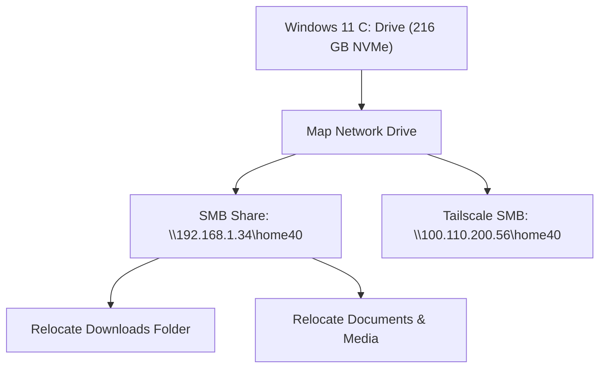

# Windows 11 Disk Recovery & SMB Storage Offloading Guide

**Target System**: Windows 11 (`C:\` / `/dev/nvme0n1p3`)  
**Network NAS Server**: `smb://192.168.1.34/home40` (or `smb://100.110.200.56/home40` via Tailscale)  
**Date**: July 31, 2026

---

## 1. High-Yield Windows Disk Space Recovery

When Windows 11 downloads major updates, system caches (`SoftwareDistribution`, `WinSxS`, `Windows.old`) balloon on the `C:` drive. Run the following phases to recover **40 GB – 80+ GB** of space.

### Method A: Automated Cleanup via Windows Command Prompt (Administrator)

Open **Command Prompt as Administrator** in Windows 11 (`Search cmd` -> `Right-click` -> `Run as Administrator`), then execute the following blocks:

```cmd
:: 1. Disable Hibernation File (Reclaims ~12 GB RAM-dump file)
powercfg /h off

:: 2. Stop Update Service & Clear Downloaded Update Cache (Reclaims 10 - 25 GB)
net stop wuauserv
del /f /s /q C:\Windows\SoftwareDistribution\Download\*
net start wuauserv

:: 3. Clean Component Store / WinSxS (Reclaims 5 - 15 GB)
Dism.exe /online /Cleanup-Image /StartComponentCleanup /ResetBase

:: 4. Remove Previous Windows Update Backups (Reclaims 15 - 35 GB)
rd /s /q C:\Windows.old
rd /s /q C:\$WINDOWS.~BT
```

---

### Method B: Offline Linux Emergency Cleanup (Run from Ubuntu)

If Windows `C:` is too full to boot cleanly, run these commands in Ubuntu Linux to clear update installer caches offline:

```bash
# 1. Mount Windows OS Partition
sudo mkdir -p /mnt/win_os
sudo mount /dev/nvme0n1p3 /mnt/win_os

# 2. Clear Windows Update Caches & Temp Files
sudo rm -rf /mnt/win_os/Windows/SoftwareDistribution/Download/*
sudo rm -rf /mnt/win_os/Windows/Temp/*
sudo rm -rf /mnt/win_os/Users/*/AppData/Local/Temp/*
```

---

## 2. Mapping & Offloading to the 13 TB SMB Server

Connect Windows 11 directly to your 13 TB SMB server (`home40`) to store downloads, media, and heavy profile folders over local LAN or Tailscale.



### Step 1: Map Network Drive in Windows File Explorer
1. Open **File Explorer** in Windows 11.
2. Right-click **This PC** (or click the three dots `...`) -> Select **Map network drive...**
3. Select Drive Letter (e.g. `Z:`).
4. Enter Folder Path:
   * **Local Subnet**: `\\192.168.1.34\home40`
   * **Remote / Tailscale**: `\\100.110.200.56\home40`
5. Check **Reconnect at sign-in**.
6. Click **Finish**.

### Step 2: Relocate Default Downloads & User Folders to SMB NAS
1. In File Explorer, right-click the **Downloads** folder -> Select **Properties**.
2. Click the **Location** tab -> Click **Move...**
3. Browse to your mapped SMB server (`Z:\Downloads` or `\\192.168.1.34\home40\Downloads`).
4. Click **Apply** -> Click **Yes** when prompted to move existing files.
5. Repeat for **Documents**, **Videos**, or **Pictures** as desired.

---

## 3. Disabling Windows Password / Hello PIN Override

If Windows 11 PIN errors or Microsoft Account prompts lock you out:
1. In Ubuntu Linux, mount `/dev/nvme0n1p3` to `/mnt/win_os`.
2. Enable the built-in local `Administrator` account:
   ```bash
   cd /mnt/win_os/Windows/System32/config
   chntpw -u "Administrator" SAM
   ```
3. Press `2` (Unlock/enable), press `1` (Clear password), press `q`, then press `y` to save.
4. Reboot into Windows 11 and log in directly using `Administrator`.

---
*Guide created by Antigravity AI for alan-USB-g5.*
